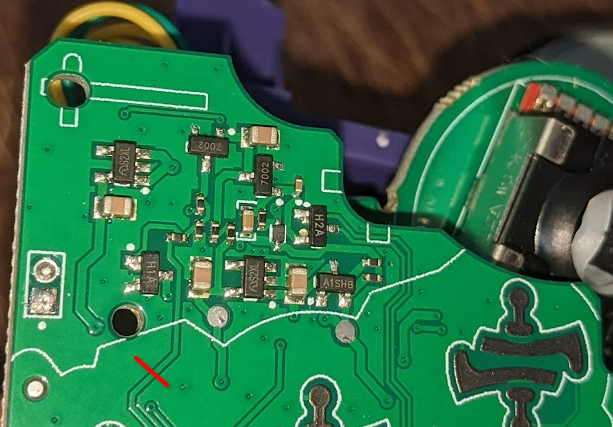

# 8bitdo GC modkit no-connect on charge mod
The 8bitdo GC modkit have the anoying behavior of powering on and trying to connect to last BT device when connected to be charged.

If you use the GameCube internal mod this is anoying because it will trigger the console power on.

This page detail how to mod the 8bitdo modkit to disable the connect on charge feature.
After this mod the modkit will only power on with the Start button.

## Disconect USB VBUS from power on logic circuit

Cut the trace near the power on circuitry as idicated by the red line:\

Simply doing this step is enough to remove the connect on charge behavior.

## Restoring the charge LED (Optional)

The charge LED is controlled by the modkit MCU. Since it won't power on anymore the LED will not light up anymore. (Actualy, even unmodded if you turn off the modkit with Start while charging the LED turn off!)

Unfortunately the LEDs are configured as current source (Rather than a current sink like the TP4056 datasheet suggest!). So we need to use an inverter to turn the logic of the charge pin around.

Parts needed:
* TTL Inverter SN74AHCT1G04DBVR ([Digikey](https://www.digikey.ca/en/products/detail/texas-instruments/SN74AHCT1G04DBVR/276756))
* 2x 2Kohm resistors 1/8W ([Digikey](https://www.digikey.ca/en/products/detail/stackpole-electronics-inc/CF18JT2K00/1741658))

* Remove the resistor pointed by the red arrow near the TP4056 charge IC.\

* Cut the trace marker with the red line near the TP4056 charge IC.\

* Remove the resistor pointed by the red arrow near the charge cable port.\

* Scrach the soldermask where the red circle is. This will be the GND connection for the inverter pin 3. The VBUS connection for pin 5 will be the pad pointed by the red arrow.\

* Solder the inverter on the modkit pcb as below.\

* Solder a resistor between pin 4 and pin 7 of the TP4056 charge IC.
* Solder a wire between pin 7 of the TP4056 charge IC and pin 2 of the inverter.
* Solder a resistor between pin 4 of the iverter and the pad near the charge connector port.\

This complete the mod for restoring the charger LED.
