# Table of contents
* [Parallel 1P (12 buttons) adapter cable (NeoGeo, Supergun, JAMMA)](#parallel-1p-5v-12-buttons-adapter-cable)
* [Parallel 2P (6 buttons each) adapter cable (Atari 2600, Master System)](#parallel-2p-5v-6-buttons-each-adapter-cable)
* [FC / NES adapter cable](#fc--nes-adapter-cable)
* [7800 adapter cable](#7800-adapter-cable)
* [PCE / TG16 adapter cable](#pce--tg16-adapter-cable)
* [Genesis adapter cable](#genesis-adapter-cable)
* [SFC / SNES adapter cable](#sfc--snes-adapter-cable)
* [CD-i adapter cable](#cd-i-adapter-cable)
* [3DO adapter cable](#3do-adapter-cable)
* [Jaguar adapter cable](#jaguar-adapter-cable)
* [PSX / PS2 adapter cable](#psx--ps2-adapter-cable)
* [Saturn adapter cable](#saturn-adapter-cable)
* [PC-FX adapter cable](#pc-fx-adapter-cable)
* [JVS adapter cable](#jvs-adapter-cable)
* [Virtual Boy adapter cable](#virtual-boy-adapter-cable)
* [Nintendo 64 adapter cable](#nintendo-64-adapter-cable)
* [Dreamcast adapter cable](#dreamcast-adapter-cable)
* [GameCube adapter cable](#gamecube-adapter-cable)

# Parallel 1P 5V (12 buttons) adapter cable
For NeoGeo, Supergun, JAMMA or any other 5V parallel input system.

No auto detection in universal FW, configure Parallel_1P_PP system in web or use dedicated FW.

## Pinout reference
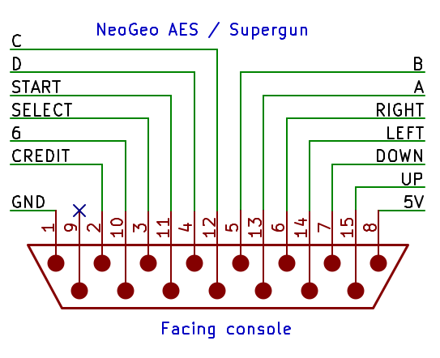

## DIY Through-hole

### Bill of materials
* DB25 Male solder cup (x1) (DKPN: AE10984-ND PN: A-DS 25 LL/Z)
* 74AHCT125N DIP14 (x3) (DKPN: 296-4655-5-ND PN: SN74AHCT125N)
* DB25 Backshell (x1) (DKPN: 970-25BPE-ND PN: 970-025-010R011)
* NeoGeo DB15 controller plug (x1) (or any other parallel interface)

### Cable schematic
Typical parallel input system simply use a switch between input line and GND which pull it low on button press.
The input line idle high via a pull-up resistor in the console. To best emulate this behavior use the open drain
schematic.

 [https://github.com/darthcloud/BlueRetroHW/blob/master/DIY/Para1P_OD.pdf](https://github.com/darthcloud/BlueRetroHW/blob/master/DIY/Para1P_OD.pdf)

If for a specific application you need the line to be actively be driven high you can follow the Push-Pull variant.

 [https://github.com/darthcloud/BlueRetroHW/blob/master/DIY/Para1P_PP.pdf](https://github.com/darthcloud/BlueRetroHW/blob/master/DIY/Para1P_PP.pdf)

For both schema variant configure/flash the Parallel_1P_PP BlueRetro Push-Pull mode/FW. For 5V system the OD is handled by the 74AHCT125N.

### Assembly instructions
* If using an universal FW, make sure to connect I34, I35 & I39 to GND

## SMD Cable PCB

### Bill of materials
* DB25 Male solder cup (x1) (DKPN: AE10984-ND PN: A-DS 25 LL/Z)
* 74AHCT1G125 SC70-5 (x12) (DKPN: 296-4709-1-ND PN: SN74AHCT1G125DCKR)
* DB25 Backshell (x1) (DKPN: 970-25BPE-ND PN: 970-025-010R011)
* Open drain PCB (x1)
* NeoGeo DB15 controller plug (x1) (or any other parallel interface)

### Assembly instructions

* Solder 74AHCT1G125 to footprint highlighted in red.
* Bridge HI side of jumper I39.
* Connect cords according to table below and pinout reference.

PCB PAD | Cord | Pin | Name | Use | Required?
------- | ---- | --- | ---- | --- | ---------
VIN | NEOGEO P1 | 8 | 5V | BlueRetro Power | Yes
GND | NEOGEO P1 | 1 | GND | BlueRetro Power | Yes
IO5 | NEOGEO P1 | 7 | DOWN | Player 1 BTN | No
IO3 | NEOGEO P1 | 15 | UP | Player 1 BTN | No
IO27 | NEOGEO P1 | 5 | B | Player 1 BTN | No
IO26 | NEOGEO P1 | 13 | A | Player 1 BTN | No
IO23 | NEOGEO P1 | 6 | RIGHT | Player 1 BTN | No
IO18 | NEOGEO P1 | 14 | LEFT | Player 1 BTN | No
IO21 | NEOGEO P1 | 4 | D | Player 1 BTN | No
IO19 | NEOGEO P1 | 12 | C | Player 1 BTN | No
IO32 | NEOGEO P1 | 11 | START | Player 1 BTN | No
IO33 | NEOGEO P1 | 2 | CREDIT | Player 1 BTN | No
IO25 | NEOGEO P1 | 10 | 6 | Player 1 BTN | No
IO22 | NEOGEO P1 | 3 | SELECT | Player 1 BTN | No

# Parallel 2P 5V (6 buttons each) adapter cable
For Atari 2600, Master System or any other 5V parallel input system.

No auto detection in universal FW, configure Parallel_2P_PP system in web or use dedicated FW.

## Pinout reference
\
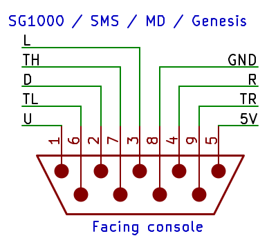

## DIY Through-hole

### Bill of materials
* DB25 Male solder cup (x1) (DKPN: AE10984-ND PN: A-DS 25 LL/Z)
* 74AHCT125N DIP14 (x3) (DKPN: 296-4655-5-ND PN: SN74AHCT125N)
* DB25 Backshell (x1) (DKPN: 970-25BPE-ND PN: 970-025-010R011)
* Genesis DB9 controller plug (x2)

### Cable schematic
Typical parallel input system simply use a switch between input line and GND which pull it low on button press.
The input line idle high via a pull-up resistor in the console. To best emulate this behavior use the open drain
schematic.

 [https://github.com/darthcloud/BlueRetroHW/blob/master/DIY/Para2P_OD.pdf](https://github.com/darthcloud/BlueRetroHW/blob/master/DIY/Para2P_OD.pdf)

If for a specific application you need the line to be actively be driven high you can follow the Push-Pull variant.

 [https://github.com/darthcloud/BlueRetroHW/blob/master/DIY/Para2P_PP.pdf](https://github.com/darthcloud/BlueRetroHW/blob/master/DIY/Para2P_PP.pdf)

For both schema variant configure/flash the Parallel_2P_PP BlueRetro Push-Pull mode/FW. For 5V system the OD is handled by the 74AHCT125N.

### Assembly instructions
* If using an universal FW, make sure to connect IO32, I34, I35 & I39 to GND

## SMD Cable PCB

### Bill of materials
* DB25 Male solder cup (x1) (DKPN: AE10984-ND PN: A-DS 25 LL/Z)
* 74AHCT1G125 SC70-5 (x12) (DKPN: 296-4709-1-ND PN: SN74AHCT1G125DCKR)
* DB25 Backshell (x1) (DKPN: 970-25BPE-ND PN: 970-025-010R011)
* Open drain PCB (x1)
* Genesis DB9 controller plug (x2)

### Assembly instructions
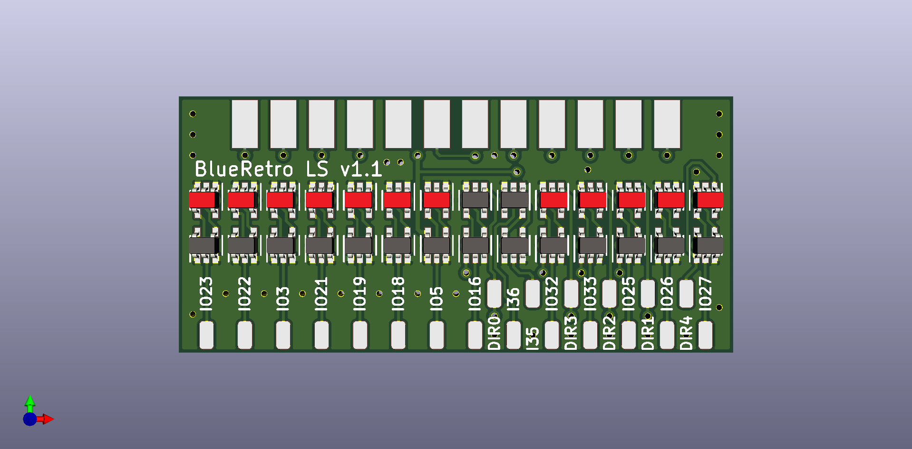
* Solder 74AHCT1G125 to footprint highlighted in red.
* Bridge HI side of jumper I39.
* Connect cords according to table below and pinout reference.

PCB PAD | Cord | Pin | Name | Use | Required?
------- | ---- | --- | ---- | --- | ---------
VIN | SMS P1 | 5 | 5V | BlueRetro Power | Yes
VIN | SMS P1 | 7 | 5V | BlueRetro Power | Yes
GND | SMS P1 | 8 | GND | BlueRetro Power | Yes
IO5 | SMS P1 | 2 | P1_D | Player 1 D1 | Yes
IO3 | SMS P1 | 1 | P1_U | Player 1 D0 | Yes
IO27 | SMS P1 | 9 | P1_TR | Player 1 D4 | Yes
IO26 | SMS P1 | 6 | P1_TL | Player 1 D5 | Yes
IO23 | SMS P1 | 4 | P1_R | Player 1 D3 | Yes
IO18 | SMS P1 | 3 | P1_L | Player 1 D2 | Yes
VIN | SMS P2 | 5 | 5V | BlueRetro Power | No
VIN | SMS P2 | 7 | 5V | BlueRetro Power | No
GND | SMS P2 | 8 | GND | BlueRetro Power | No
IO21 | SMS P2 | 2 | P2_D | Player 2 D1 | No
IO19 | SMS P2 | 1 | P2_U | Player 2 D0 | No
IO16 | SMS P2 | 9 | P2_TR | Player 2 D4 | No
IO33 | SMS P2 | 6 | P2_TL | Player 2 D5 | No
IO25 | SMS P2 | 4 | P2_R | Player 2 D3 | No
IO22 | SMS P2 | 3 | P2_L | Player 2 D2 | No

# FC / NES adapter cable

## Pinout reference
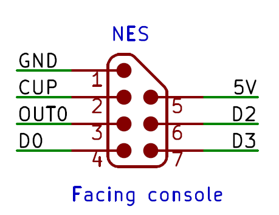
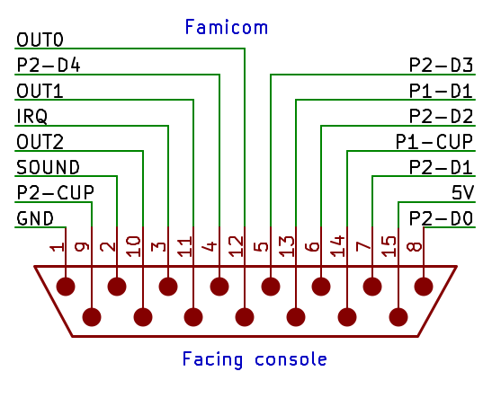

## DIY Through-hole

### Bill of materials
* DB25 Male solder cup (x1) (DKPN: AE10984-ND PN: A-DS 25 LL/Z)
* 74AHCT125N DIP14 (x2) (DKPN: 296-4655-5-ND PN: SN74AHCT125N)
* 3.6K resistors (x3) (DKPN: S3.6KCACT-ND PN: RNMF14FTC3K60) (Required for PAL system only)
* DB25 Backshell (x1) (DKPN: 970-25BPE-ND PN: 970-025-010R011)
* NES controller plug (x2)
* Famicom controller plug (x1) (Optional)

### Cable schematic
 [https://github.com/darthcloud/BlueRetroHW/blob/master/DIY/NES.pdf](https://github.com/darthcloud/BlueRetroHW/blob/master/DIY/NES.pdf)

### Assembly instructions
* If using an universal FW, make sure to connect I39 to 3.3V and IO33, I34 & I35 to GND.
* If using an universal FW AND not wiring 2nd port plug, make sure to connect IO22 to GND.
* If using an universal FW AND not wiring Famicom 4P adapter, make sure to connect IO21 & IO25 to GND.
* If not wiring 2nd port plug, make sure to connect IO18 (P2_CUP) to 3.3V

## SMD Cable PCB

### Bill of materials
* DB25 Male solder cup (x1) (DKPN: AE10984-ND PN: A-DS 25 LL/Z)
* 74AHCT1G125 SC70-5 (x7) (DKPN: 296-4709-1-ND PN: SN74AHCT1G125DCKR)
* 3.6K resistors (x3) (DKPN: 311-3.6KLRCT-ND PN: RC0402FR-073K6L) (Required for PAL system only)
* DB25 Backshell (x1) (DKPN: 970-25BPE-ND PN: 970-025-010R011)
* Level shifter PCB (x1)
* NES controller plug (x2)
* Famicom controller plug (x1) (Optional)

### Assembly instructions
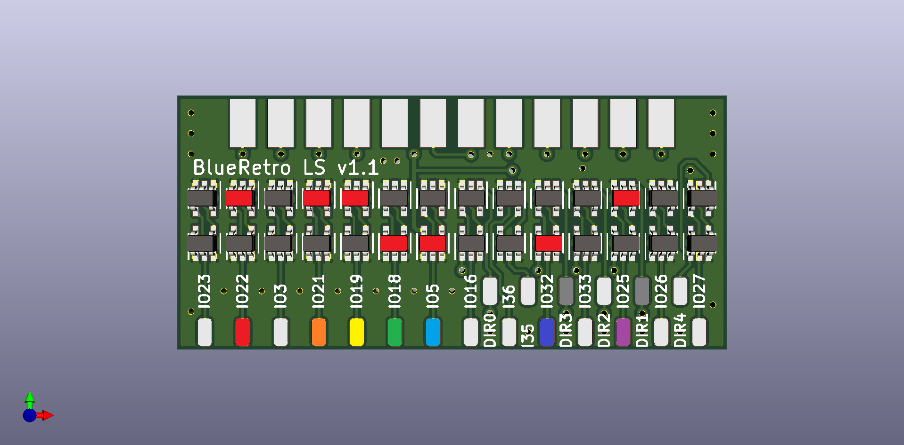
* Solder 74AHCT1G125 to footprint highlighted in red.
* Bridge HI side of jumper I39.
* Connect pad DIR3 & DIR1 to GND.
* For using PAL system, add 3.6K pull-ups to NES 5V (pin 5) on pads IO18, IO5 & IO32.
* Connect cords according to table below and pinout reference.

PCB PAD | Cord | Pin | Name | Use | Required?
------- | ---- | --- | ---- | --- | ---------
VIN | NES P1 | 5 | 5V | BlueRetro Power | Yes
GND | NES P1 | 1 | GND | BlueRetro Power | Yes
IO32 | NES P1 | 3 | OUT0 | Latch for all accessories | Yes
IO19 | NES P1 | 4 | P1_D0 | Player 1 / Four Score DATA | Yes
IO5 | NES P1 | 2 | P1_CUP | Player 1 / Four Score CLK | Yes
VIN | NES P2 | 5 | 5V | BlueRetro Power | No
GND | NES P2 | 1 | GND | BlueRetro Power | No
IO22 | NES P2 | 4 | P2_D0 | Player 2 / Four Score DATA | No
IO18 | NES P2 | 2 | P2_CUP | Player 2 / Four Score CLK | No
IO21 | FC_DB15 | 13 | P1_D1 | FC 4P adapter P3 DATA | No
IO25 | FC_DB15 | 7 | P2_D1 | FC 4P adapter P4 DATA | No

# 7800 adapter cable
No auto detection in universal FW, configure Parallel_2P_PP system in web or use dedicated FW.

## Pinout reference
\

## DIY Through-hole

### Bill of materials
* DB25 Male solder cup (x1) (DKPN: AE10984-ND PN: A-DS 25 LL/Z)
* 74AHCT125N DIP14 (x3) (DKPN: 296-4655-5-ND PN: SN74AHCT125N)
* CD74HC4053E DIP16 (x2) (DKPN: 296-9219-5-ND PN: CD74HC4053E)
* 620 Ohm resistors (x4) (DKPN: CF14JT620RCT-ND PN: CF14JT620R)
* DB25 Backshell (x1) (DKPN: 970-25BPE-ND PN: 970-025-010R011)
* Genesis DB9 controller plug (x2)

### Cable schematic
 [https://github.com/darthcloud/BlueRetroHW/blob/master/DIY/7800.pdf](https://github.com/darthcloud/BlueRetroHW/blob/master/DIY/7800.pdf)

### Assembly instructions
* If using an universal FW, make sure to connect IO32, I34, I35 & I39 to GND

# PCE / TG16 adapter cable

## Pinout reference

## DIY Through-hole

### Bill of materials
* DB25 Male solder cup (x1) (DKPN: AE10984-ND PN: A-DS 25 LL/Z)
* 74AHCT125N DIP14 (x2) (DKPN: 296-4655-5-ND PN: SN74AHCT125N)
* 47K resistors (x2) (DKPN: S47KCACT-ND PN: RNMF14FTC47K0)
* DB25 Backshell (x1) (DKPN: 970-25BPE-ND PN: 970-025-010R011)
* Mini-DIN-8 plug and/or DIB-8 plug (x1)

### Cable schematic
 [https://github.com/darthcloud/BlueRetroHW/blob/master/DIY/PCE.pdf](https://github.com/darthcloud/BlueRetroHW/blob/master/DIY/PCE.pdf)

### Assembly instructions
* If using an universal FW, make sure to connect I39 to 3.3V and IO19, IO21, IO22, IO25, IO32, I34 & I35 to GND.

## SMD Cable PCB

### Bill of materials
* DB25 Male solder cup (x1) (DKPN: AE10984-ND PN: A-DS 25 LL/Z)
* 74AHCT1G125 SC70-5 (x6) (DKPN: 296-4709-1-ND PN: SN74AHCT1G125DCKR)
* 47K resistors (x2) (DKPN: 311-47.0KLRCT-ND PN: RC0402FR-0747KL)
* DB25 Backshell (x1) (DKPN: 970-25BPE-ND PN: 970-025-010R011)
* Level shifter PCB (x1)
* Mini-DIN-8 plug and/or DIB-8 plug (x1)

### Assembly instructions
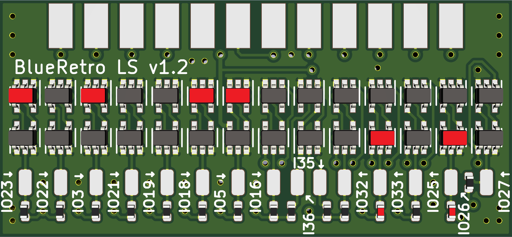
* Solder 74AHCT1G125 to footprint highlighted in red.
* Solder resistors to footprint highlighted in red.
* Bridge HI side of jumper I39.
* Connect pad DIR2 to GND.
* Connect cords according to table below and pinout reference.

PCB PAD | Cord | Pin | Name | Use | Required?
------- | ---- | --- | ---- | --- | ---------
VIN | PCE/TG16 P1 | 1 | 5V | BlueRetro Power | Yes
GND | PCE/TG16 P1 | 8 | GND | BlueRetro Power | Yes
IO3 | PCE/TG16 P1 | 2 | P1_U | Player 1 D0 | Yes
IO5 | PCE/TG16 P1 | 3 | P1_R | Player 1 D1 | Yes
IO18 | PCE/TG16 P1 | 4 | P1_D | Player 1 D2 | Yes
IO23 | PCE/TG16 P1 | 5 | P1_L | Player 1 D3 | Yes
I33 | PCE/TG16 P1 | 6 | P1_SEL | Player 1 SEL | Yes
IO26 | PCE/TG16 P1 | 7 | P1_OE | Player 1 /OE | Yes

# Genesis adapter cable
**Once in Genesis mode nothing will be output on the serial console as the TXD pin is used for multitap support.**

## Pinout reference

## DIY Through-hole

### Bill of materials
* DB25 Male solder cup (x1) (DKPN: AE10984-ND PN: A-DS 25 LL/Z)
* 74AHCT125N DIP14 (x4) (DKPN: 296-4655-5-ND PN: SN74AHCT125N)
* 74AHCT126N DIP14 (x1) (DKPN: 296-4659-5-ND PN: SN74AHCT126N) (Optional only for multitap support)
* 74AHCT32N DIP14 (x1) (DKPN: 296-4732-5-ND PN: SN74AHCT32N) (Optional only for multitap support)
* DB25 Backshell (x1) (DKPN: 970-25BPE-ND PN: 970-025-010R011)
* Genesis DB9 controller plug (x2)

### Cable schematic
 [https://github.com/darthcloud/BlueRetroHW/blob/master/DIY/Genesis.pdf](https://github.com/darthcloud/BlueRetroHW/blob/master/DIY/Genesis.pdf)

### Assembly instructions
* If using an universal FW, make sure to connect I39 to 3.3V and I34 to GND.
* If using an universal FW AND not wiring 2nd port plug, make sure to connect IO19, IO21, IO22, IO25 & IO33 to GND.
* If using an universal FW AND not wiring Multitap support, make sure to connect IO32 to GND.
* If not wiring 2nd port plug, make sure to connect I36 (P2_TH) to 3.3V

## SMD Cable PCB

### Bill of materials
* DB25 Male solder cup (x1) (DKPN: AE10984-ND PN: A-DS 25 LL/Z)
* 74AHCT1G125 SC70-5 (x14) (DKPN: 296-4709-1-ND PN: SN74AHCT1G125DCKR)
* 74AHCT1G126 SC70-5 (x3) (DKPN: 296-4711-1-ND PN: SN74AHCT1G126DCKR) (Optional only for multitap support)
* 74AHCT1G32 SC70-5 (x1) (DKPN: 296-4713-1-ND PN: SN74AHCT1G32DCKR) (Optional only for multitap support)
* DB25 Backshell (x1) (DKPN: 970-25BPE-ND PN: 970-025-010R011)
* Level shifter PCB (x1)
* Genesis DB9 controller plug (x2)

### Assembly instructions
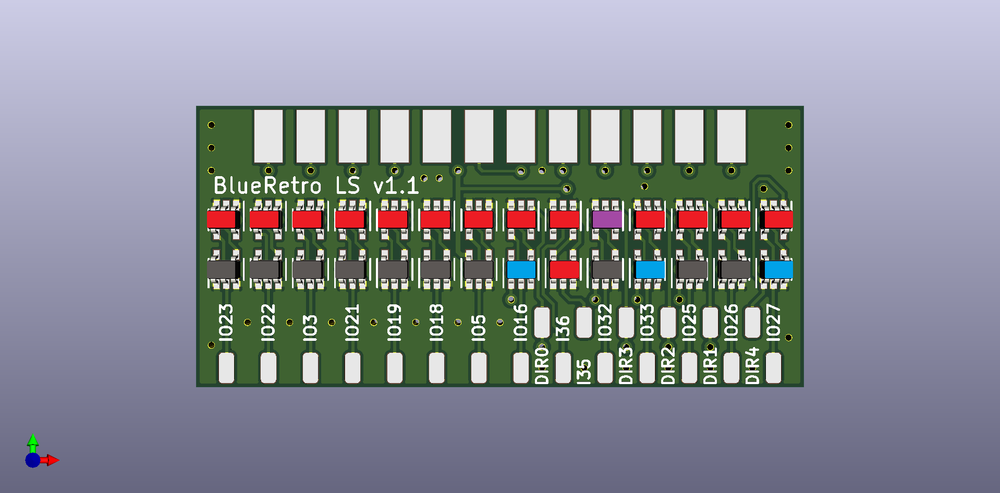
* Solder 74AHCT1G125 to footprint highlighted in red.
* Solder 74AHCT1G126 to footprint highlighted in blue. (Optional only for multitap support)
* Solder 74AHCT1G32 to footprint highlighted in purple. (Optional only for multitap support)
* Bridge HI side of jumper I39.
* Connect pad DIR1 to GND.
* Connect pin 2 of DB25 connector to pad DIR2 & DIR3. (Optional only for multitap support, GND pad DIR2 & DIR3 otherwise)
* Connect pin 11 of DB25 to pad DIR4. (Optional only for multitap support, GND pad DIR4 otherwise)
* Connect pad IO32 to pad DIR0. (Optional only for multitap support, GND pad DIR0 otherwise)
* Connect cords according to table below and pinout reference.

PCB PAD | Cord | Pin | Name | Use | Required?
------- | ---- | --- | ---- | --- | ---------
VIN | GENESIS P1 | 5 | 5V | BlueRetro Power | Yes
GND | GENESIS P1 | 8 | GND | BlueRetro Power | Yes
IO5 | GENESIS P1 | 2 | P1_D | Player 1 D1 | Yes
IO3 | GENESIS P1 | 1 | P1_U | Player 1 D0 | Yes
I35 | GENESIS P1 | 7 | P1_TH | Player 1 CTRL | Yes
IO27 | GENESIS P1 | 9 | P1_TR | Player 1 D4/CTRL | Yes
IO26 | GENESIS P1 | 6 | P1_TL | Player 1 D5/CTRL | Yes
IO23 | GENESIS P1 | 4 | P1_R | Player 1 D3 | Yes
IO18 | GENESIS P1 | 3 | P1_L | Player 1 D2 | Yes
VIN | GENESIS P2 | 5 | 5V | BlueRetro Power | No
GND | GENESIS P2 | 8 | GND | BlueRetro Power | No
IO21 | GENESIS P2 | 2 | P2_D | Player 2 D1 | No
IO19 | GENESIS P2 | 1 | P2_U | Player 2 D0 | No
I36 | GENESIS P2 | 7 | P2_TH | Player 2 CTRL | No
IO16 | GENESIS P2 | 9 | P2_TR | Player 2 D4/CTRL | No
IO33 | GENESIS P2 | 6 | P2_TL | Player 2 D5/CTRL | No
IO25 | GENESIS P2 | 4 | P2_R | Player 2 D3 | No
IO22 | GENESIS P2 | 3 | P2_L | Player 2 D2 | No

# SFC / SNES adapter cable

## Pinout reference

## DIY Through-hole

### Bill of materials
* DB25 Male solder cup (x1) (DKPN: AE10984-ND PN: A-DS 25 LL/Z)
* 74AHCT125N DIP14 (x3) (DKPN: 296-4655-5-ND PN: SN74AHCT125N)
* 3.6K resistors (x5) (DKPN: S3.6KCACT-ND PN: RNMF14FTC3K60) (Required for PAL system only)
* DB25 Backshell (x1) (DKPN: 970-25BPE-ND PN: 970-025-010R011)
* SNES controller plug (x2) (For multitap support 7 conductor are required, get a 3rd SNES extension for pin donation and use cable from PSX/Genesis/Saturn for the extra wires)

### Cable schematic
 [https://github.com/darthcloud/BlueRetroHW/blob/master/DIY/SNES.pdf](https://github.com/darthcloud/BlueRetroHW/blob/master/DIY/SNES.pdf)

### Assembly instructions
* If using an universal FW, make sure to connect I39 to GND and IO33, I34 & I35 to GND.
* If using an universal FW AND not wiring 2nd port plug, make sure to connect IO22 to GND.
* If using an universal FW AND not wiring Multitap support, make sure to connect IO21 & IO25 to GND.
* If not wiring 2nd port plug, make sure to connect IO18 (P2_CLK) to 3.3V

## SMD Cable PCB

### Bill of materials
* DB25 Male solder cup (x1) (DKPN: AE10984-ND PN: A-DS 25 LL/Z)
* 74AHCT1G125 SC70-5 (x9) (DKPN: 296-4709-1-ND PN: SN74AHCT1G125DCKR)
* 3.6K resistors (x5) (DKPN: 311-3.6KLRCT-ND PN: RC0402FR-073K6L) (Required for PAL system only)
* DB25 Backshell (x1) (DKPN: 970-25BPE-ND PN: 970-025-010R011)
* Level shifter PCB (x1)
* SNES controller plug (x2) (For multitap support 7 conductor are required, get a 3rd SNES extension for pin donation and use cable from PSX/Genesis/Saturn for the extra wires)

### Assembly instructions
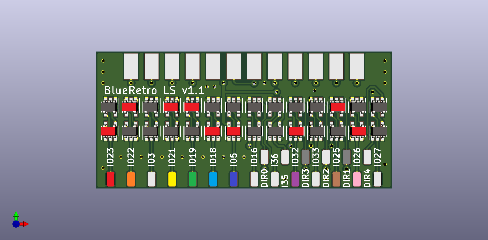
* Solder 74AHCT1G125 to footprint highlighted in red.
* Bridge LO side of jumper I39.
* Connect pad DIR3 & DIR1 to GND.
* For using PAL system, add 3.6K pull-ups to SNES 5V (pin 1) on pads IO23, IO18, IO5, IO32 & IO26.
* Connect cords according to table below and pinout reference.

PCB PAD | Cord | Pin | Name | Use | Required?
------- | ---- | --- | ---- | --- | ---------
VIN | SNES P1 | 1 | 5V | BlueRetro Power | Yes
GND | SNES P1 | 7 | GND | BlueRetro Power | Yes
IO5 | SNES P1 | 2 | P1_CLK | Player 1 / Multitap 1 CLK | Yes
IO32 | SNES P1 | 3 | LATCH | Latch for all accessories | Yes
IO19 | SNES P1 | 4 | P1_D0 | Player 1 / Multitap 1 DATA | Yes
IO21 | SNES P1 | 5 | P1_D1 | Multitap 1 DATA | No
IO23 | SNES P1 | 6 | P1_SEL | Multitap 1 CTRL | No
VIN | SNES P2 | 1 | 5V | BlueRetro Power | No
GND | SNES P2 | 7 | GND | BlueRetro Power | No
IO18 | SNES P2 | 2 | P2_CLK | Player 2 / Multitap 2 CLK | No
IO22 | SNES P2 | 4 | P2_D0 | Player 2 / Multitap 2 DATA | No
IO25 | SNES P2 | 5 | P2_D1 | Multitap 2 DATA | No
IO26 | SNES P2 | 6 | P2_SEL | Multitap 2 CTRL | No

# CD-i adapter cable

## Pinout reference
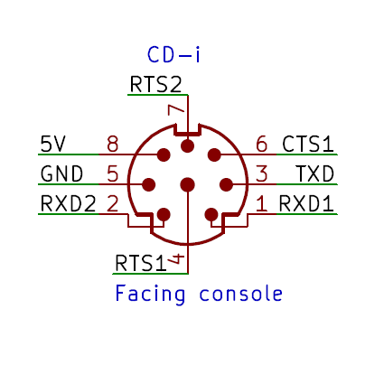

## DIY Through-hole

### Bill of materials
* DB25 Male solder cup (x1) (DKPN: AE10984-ND PN: A-DS 25 LL/Z)
* 74AHCT125N DIP14 (x2) (DKPN: 296-4655-5-ND PN: SN74AHCT125N)
* DB25 Backshell (x1) (DKPN: 970-25BPE-ND PN: 970-025-010R011)
* Mini-DIN-8 plug (x1 or x2)

### Cable schematic
 [https://github.com/darthcloud/BlueRetroHW/blob/master/DIY/CDI.pdf](https://github.com/darthcloud/BlueRetroHW/blob/master/DIY/CDI.pdf)

### Assembly instructions
* If using an universal FW, make sure to connect I39 to GND and IO25, IO32, IO33, I34 & I35 to GND.
* Do not use CD-i 5V.
* External power (ESP-DevkitC USB) required as CD-i look for peripheral once before BlueRetro is fully done reading it's config. Power up BlueRetro externally first, then 1 sec later power on CD-i.
* If not wiring 2nd port plug, make sure to connect IO21 (P2_RTS) to GND.

## SMD Cable PCB

### Bill of materials
* DB25 Male solder cup (x1) (DKPN: AE10984-ND PN: A-DS 25 LL/Z)
* 74AHCT1G125 SC70-5 (x4) (DKPN: 296-4709-1-ND PN: SN74AHCT1G125DCKR)
* DB25 Backshell (x1) (DKPN: 970-25BPE-ND PN: 970-025-010R011)
* Level shifter PCB (x1)
* Mini-DIN-8 plug (x1 or x2)

### Assembly instructions
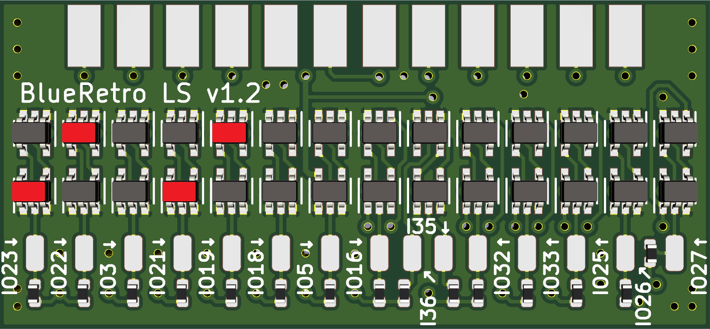
* External power (BlueRetro USB) required as CD-i look for peripheral once before BlueRetro is fully done reading it's config. Power up BlueRetro externally first, then 1 sec later power on CD-i.
* Solder 74AHCT1G125 to footprint highlighted in red.
* Bridge LO side of jumper I39.
* Connect cords according to table below and pinout reference.

PCB PAD | Cord | Pin | Name | Use | Required?
------- | ---- | --- | ---- | --- | ---------
GND | CDI P1 | 5 | GND | BlueRetro Power | Yes
IO23 | CDI P1 | 7 | RTS | Enable | Yes
IO22 | CDI P1 | 2 | RXD | Data | Yes
GND | CDI P2 | 5 | GND | BlueRetro Power | No
IO21 | CDI P2 | Front: 4 or Rear: 7 | RTS | Enable | No
IO19 | CDI P2 | Front: 1 or Rear: 2 | RXD | Data | No

# 3DO adapter cable

## Pinout reference

## DIY Through-hole

### Bill of materials
* DB25 Male solder cup (x1) (DKPN: AE10984-ND PN: A-DS 25 LL/Z)
* 74AHCT125N DIP14 (x2) (DKPN: 296-4655-5-ND PN: SN74AHCT125N)
* DB25 Backshell (x1) (DKPN: 970-25BPE-ND PN: 970-025-010R011)
* Genesis controller plug (x1)

### Cable schematic
 [https://github.com/darthcloud/BlueRetroHW/blob/master/DIY/3DO.pdf](https://github.com/darthcloud/BlueRetroHW/blob/master/DIY/3DO.pdf)

### Assembly instructions
* Connect IO19 (DB25-16) & IO18 (DB25-4) together (CS signal generator)
* If using an universal FW, make sure to connect I39 to GND and IO25, IO32, IO33, I34 & I35 to GND.

## SMD Cable PCB

### Bill of materials
* DB25 Male solder cup (x1) (DKPN: AE10984-ND PN: A-DS 25 LL/Z)
* 74AHCT1G125 SC70-5 (x2) (DKPN: 296-4709-1-ND PN: SN74AHCT1G125DCKR)
* DB25 Backshell (x1) (DKPN: 970-25BPE-ND PN: 970-025-010R011)
* Level shifter PCB (x1)
* Genesis controller plug (x1)

### Assembly instructions
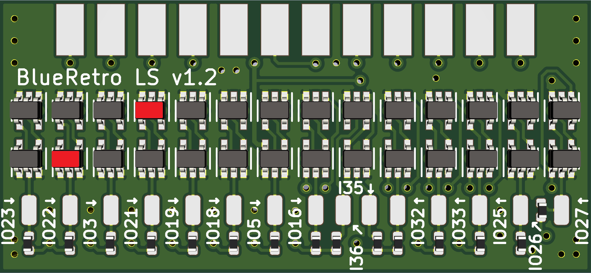
* Connect IO19 (DB25-16) & IO18 (DB25-4) together (CS signal generator)
* Solder 74AHCT1G125 to footprint highlighted in red.
* Bridge LO side of jumper I39.
* Connect cords according to table below and pinout reference.

PCB PAD | Cord | Pin | Name | Use | Required?
------- | ---- | --- | ---- | --- | ---------
VIN | 3DO P1 | 2 | 5V | BlueRetro Power | Yes
VIN | 3DO P1 | 5 | 5V | BlueRetro Power | Yes
GND | 3DO P1 | 1 | GND | BlueRetro Power | Yes
GND | 3DO P1 | 8 | GND | BlueRetro Power | Yes
IO21 | 3DO P1 | 9 | DIN | Data | Yes
IO22 | 3DO P1 | 7 | CLK | Clock | Yes

# Jaguar adapter cable

## Pinout reference
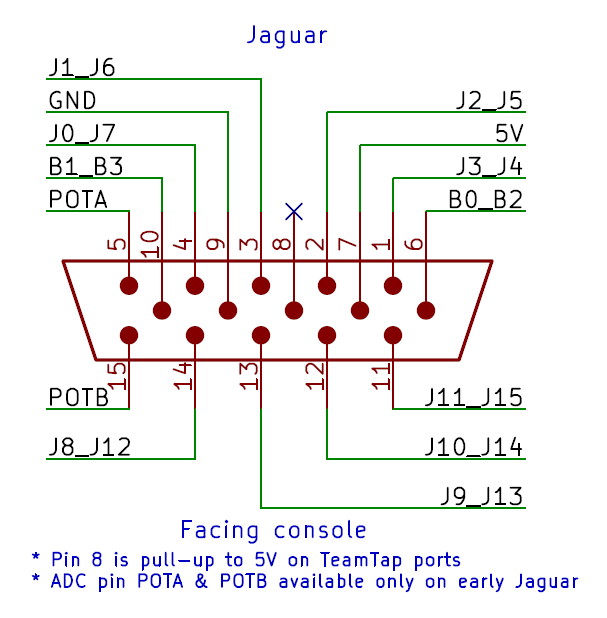

## DIY Through-hole

### Bill of materials
* DB25 Male solder cup (x1) (DKPN: AE10984-ND PN: A-DS 25 LL/Z)
* DB15-HD Male solder cup (x1) (DKPN: 609-4042-ND PN: 10090769-P154ALF)
* 74AHCT125N DIP14 (x3) (DKPN: 296-4655-5-ND PN: SN74AHCT125N)
* DB25 Backshell (x1) (DKPN: 970-25BPE-ND PN: 970-025-010R011)
* NeoGeo DB15 controller cable (x1) (or any other 15 conductors cable)

### Cable schematic
 [https://github.com/darthcloud/BlueRetroHW/blob/master/DIY/JAG.pdf](https://github.com/darthcloud/BlueRetroHW/blob/master/DIY/JAG.pdf)

## SMD Cable PCB

### Bill of materials
* DB25 Male solder cup (x1) (DKPN: AE10984-ND PN: A-DS 25 LL/Z)
* DB15-HD Male solder cup (x1) (DKPN: 609-4042-ND PN: 10090769-P154ALF)
* 74AHCT1G125 SC70-5 (x10) (DKPN: 296-4709-1-ND PN: SN74AHCT1G125DCKR)
* DB25 Backshell (x1) (DKPN: 970-25BPE-ND PN: 970-025-010R011)
* Level shifter PCB (x1)
* NeoGeo DB15 controller cable (x1) (or any other 15 conductors cable)

### Assembly instructions
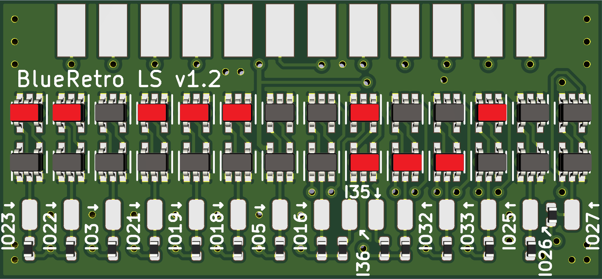
* Solder 74AHCT1G125 to footprint highlighted in red.
* Bridge HI side of jumper I39.
* Connect pad DIR1, DIR2 & DIR3 to GND.
* Connect cords according to table below and pinout reference.

PCB PAD | Cord | Pin | Name | Use | Required?
------- | ---- | --- | ---- | --- | ---------
VIN | JAGUAR P1 | 7 | 5V | BlueRetro Power | Yes
GND | JAGUAR P1 | 9 | GND | BlueRetro Power | Yes
IO18 | JAGUAR P1 | 14 | J8 | Player 1 ROW OUT | Yes
IO19 | JAGUAR P1 | 13 | J9 | Player 1 ROW OUT | Yes
IO21 | JAGUAR P1 | 12 | J10 | Player 1 ROW OUT | Yes
IO22 | JAGUAR P1 | 11 | J11 | Player 1 ROW OUT | Yes
IO23 | JAGUAR P1 | 10 | B1 | Player 1 ROW OUT | Yes
IO25 | JAGUAR P1 | 6 | B0 | Player 1 ROW OUT | Yes
IO32 | JAGUAR P1 | 4 | J0 | Player 1 COL IN | Yes
IO33 | JAGUAR P1 | 3 | J1 | Player 1 COL IN | Yes
I35 | JAGUAR P1 | 2 | J2 | Player 1 COL IN | Yes
I36 | JAGUAR P1 | 1 | J3 | Player 1 COL IN | Yes

# PSX / PS2 adapter cable

## Pinout reference

## DIY Through-hole

### Bill of materials
* AZ1117EH-5.0TRG1 LDO (x1) (DKPN: AZ1117EH-5.0TRG1DICT-ND PN: AZ1117EH-5.0TRG1) (Optional: Only if you plan using cable with BlueRetro DevKit PCB)
* 10uF Capacitor (x2) (DKPN: 399-13968-ND PN: C322C106K3R5TA) (Optional: Only if you plan using cable with BlueRetro DevKit PCB)
* DB25 Male solder cup (x1) (DKPN: AE10984-ND PN: A-DS 25 LL/Z)
* DB25 Backshell (x1) (DKPN: 970-25BPE-ND PN: 970-025-010R011)
* PSX/PS2 controller plug (x2)

### Cable schematic
 [https://github.com/darthcloud/BlueRetroHW/blob/master/DIY/PS.pdf](https://github.com/darthcloud/BlueRetroHW/blob/master/DIY/PS.pdf)

### Assembly instructions
* If using an universal FW, make sure to connect I39 to GND and I35 to GND.
* If using an universal FW AND not wiring 2nd port plug, make sure to connect IO22 & IO25 to GND.
* If not wiring 2nd port plug, make sure to connect IO5 (P2_DTR), IO26 (P2_SCK) & IO27 (P2_TXD) to 3.3V
* You may connect 8V directly into the 5V input of an ESP32-DevKitC, the onboard LDO (AMS1117-3.3) is rated for 18V.
* If planning to use a BlueRetro DevKit board wire cable the LDO is required (Onboard LDO max is 6V).

## SMD Cable PCB

### Bill of materials
* AZ1117EH-5.0TRG1 LDO (x1) (DKPN: AZ1117EH-5.0TRG1DICT-ND PN: AZ1117EH-5.0TRG1)
* 10uF Capacitor (x2) (DKPN: 490-5523-1-ND PN: GRM21BR61E106KA73L)
* DB25 Male solder cup (x1) (DKPN: AE10984-ND PN: A-DS 25 LL/Z)
* DB25 Backshell (x1) (DKPN: 970-25BPE-ND PN: 970-025-010R011)
* Passthrough PCB (x1)
* PSX/PS2 controller plug (x2)

### Assembly instructions
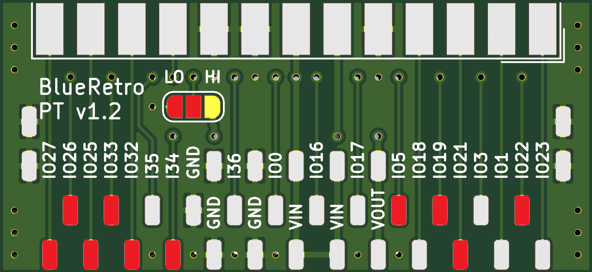
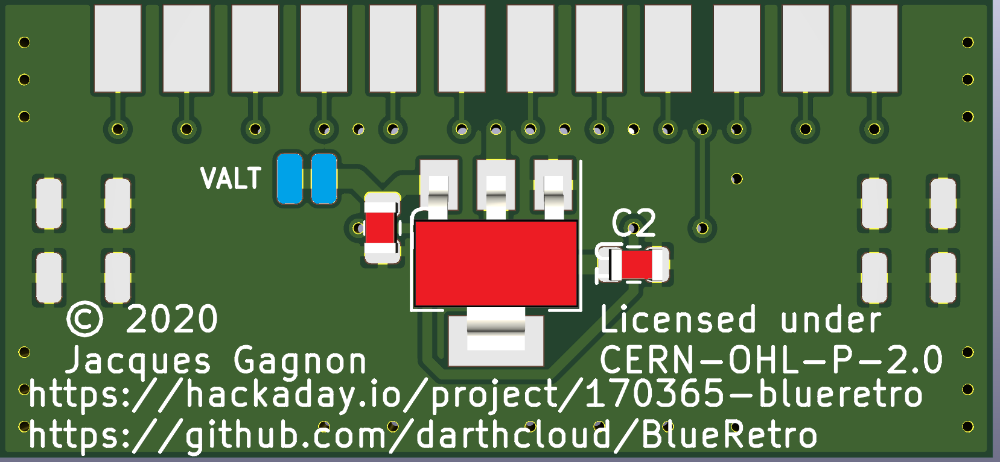
* Bridge LO side of jumper I39.
* Connect I35 pad to GND.
* Solder LDO and capacitor to PCB back.
* Connect cords according to table below and pinout reference.

PCB PAD | Cord | Pin | Name | Use | Required?
------- | ---- | --- | ---- | --- | ---------
VALT | PSX/PS2 P1 | 3 | 8V | Cable LDO Power | Yes
GND | PSX/PS2 P1 | 4 | GND | BlueRetro Power | Yes
IO19 | PSX/PS2 P1 | 1 | P1_RXD | Player 1 DATA | Yes
IO32 | PSX/PS2 P1 | 2 | P1_TXD | Player 1 CMD | Yes
I34 | PSX/PS2 P1 | 6 | P1_DTR | Player 1 CS | Yes
IO33 | PSX/PS2 P1 | 7 | P1_SCK | Player 1 CLK | Yes
IO21 | PSX/PS2 P1 | 9 | P1_DSR | Player 1 ACK | Yes
VALT | PSX/PS2 P2 | 3 | 8V | Cable LDO Power | No
GND | PSX/PS2 P2 | 4 | GND | BlueRetro Power | No
IO22 | PSX/PS2 P2 | 1 | P2_RXD | Player 2 DATA | No
IO27 | PSX/PS2 P2 | 2 | P2_TXD | Player 2 CMD | No
IO5 | PSX/PS2 P2 | 6 | P2_DTR | Player 2 CS  | No
IO26 | PSX/PS2 P2 | 7 | P2_SCK | Player 2 CLK | No
IO25 | PSX/PS2 P2 | 9 | P2_DSR | Player 2 ACK | No

# Saturn adapter cable

## Pinout reference
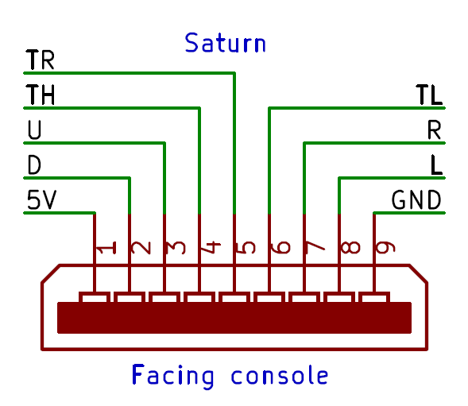

## DIY Through-hole

### Bill of materials
* DB25 Male solder cup (x1) (DKPN: AE10984-ND PN: A-DS 25 LL/Z)
* 74AHCT125N DIP14 (x4) (DKPN: 296-4655-5-ND PN: SN74AHCT125N)
* DB25 Backshell (x1) (DKPN: 970-25BPE-ND PN: 970-025-010R011)
* Saturn controller plug (x2)

### Cable schematic
 [https://github.com/darthcloud/BlueRetroHW/blob/master/DIY/Saturn.pdf](https://github.com/darthcloud/BlueRetroHW/blob/master/DIY/Saturn.pdf)

### Assembly instructions
* If using an universal FW, make sure to connect I39 to GND and IO32 & I34 to GND.
* If using an universal FW AND not wiring 2nd port plug, make sure to connect IO19, IO21, IO22, IO25 & IO33 to GND.
* If not wiring 2nd port plug, make sure to connect IO33 (P2_TL) & I36 (P2_TH) to 3.3V

## SMD Cable PCB

### Bill of materials
* DB25 Male solder cup (x1) (DKPN: AE10984-ND PN: A-DS 25 LL/Z)
* 74AHCT1G125 SC70-5 (x14) (DKPN: 296-4709-1-ND PN: SN74AHCT1G125DCKR)
* DB25 Backshell (x1) (DKPN: 970-25BPE-ND PN: 970-025-010R011)
* Level shifter PCB (x1)
* Saturn controller plug (x2)

### Assembly instructions
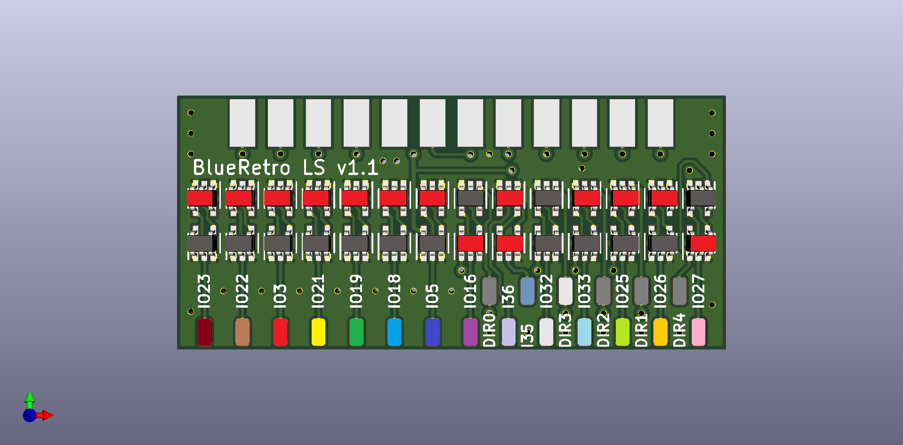
* Solder 74AHCT1G125 to footprint highlighted in red.
* Bridge LO side of jumper I39.
* Connect pad DIR0, DIR2, DIR1 & DIR4 to GND.
* Connect cords according to table below and pinout reference.

PCB PAD | Cord | Pin | Name | Use | Required?
------- | ---- | --- | ---- | --- | ---------
VIN | SATURN P1 | 1 | 5V | BlueRetro Power | Yes
GND | SATURN P1 | 9 | GND | BlueRetro Power | Yes
IO5 | SATURN P1 | 2 | P1_D | Player 1 D1 | Yes
IO3 | SATURN P1 | 3 | P1_U | Player 1 D0 | Yes
I35 | SATURN P1 | 4 | P1_TH | Player 1 CTRL | Yes
IO27 | SATURN P1 | 5 | P1_TR | Player 1 CTRL | Yes
IO26 | SATURN P1 | 6 | P1_TL | Player 1 CTRL | Yes
IO23 | SATURN P1 | 7 | P1_R | Player 1 D3 | Yes
IO18 | SATURN P1 | 8 | P1_L | Player 1 D2 | Yes
VIN | SATURN P2 | 1 | 5V | BlueRetro Power | No
GND | SATURN P2 | 9 | GND | BlueRetro Power | No
IO21 | SATURN P2 | 2 | P2_D | Player 2 D1 | No
IO19 | SATURN P2 | 3 | P2_U | Player 2 D0 | No
I36 | SATURN P2 | 4 | P2_TH | Player 2 CTRL | No
IO16 | SATURN P2 | 5 | P2_TR | Player 2 CTRL | No
IO33 | SATURN P2 | 6 | P2_TL | Player 2 CTRL | No
IO25 | SATURN P2 | 7 | P2_R | Player 2 D3 | No
IO22 | SATURN P2 | 8 | P2_L | Player 2 D2 | No

# PC-FX adapter cable

## Pinout reference

## DIY Through-hole

### Bill of materials
* DB25 Male solder cup (x1) (DKPN: AE10984-ND PN: A-DS 25 LL/Z)
* 74AHCT125N DIP14 (x2) (DKPN: 296-4655-5-ND PN: SN74AHCT125N)
* DB25 Backshell (x1) (DKPN: 970-25BPE-ND PN: 970-025-010R011)
* SNES controller plug (x2) (Take female pins out of SNES shell and make them hold together with hot glue)

### Cable schematic
 [https://github.com/darthcloud/BlueRetroHW/blob/master/DIY/PCFX.pdf](https://github.com/darthcloud/BlueRetroHW/blob/master/DIY/PCFX.pdf)

### Assembly instructions
* If using an universal FW, make sure to connect I39 to GND and IO21, IO25, IO32, I34 & I35 to GND.
* If not wiring 2nd port plug, make sure to connect IO26 (P2_/LATCH) to GND.

## SMD Cable PCB

### Bill of materials
* DB25 Male solder cup (x1) (DKPN: AE10984-ND PN: A-DS 25 LL/Z)
* 74AHCT1G125 SC70-5 (x6) (DKPN: 296-4709-1-ND PN: SN74AHCT1G125DCKR)
* DB25 Backshell (x1) (DKPN: 970-25BPE-ND PN: 970-025-010R011)
* Level shifter PCB (x1)
* SNES controller plug (x2) (Take female pins out of SNES shell and make them hold together with hot glue)

### Assembly instructions
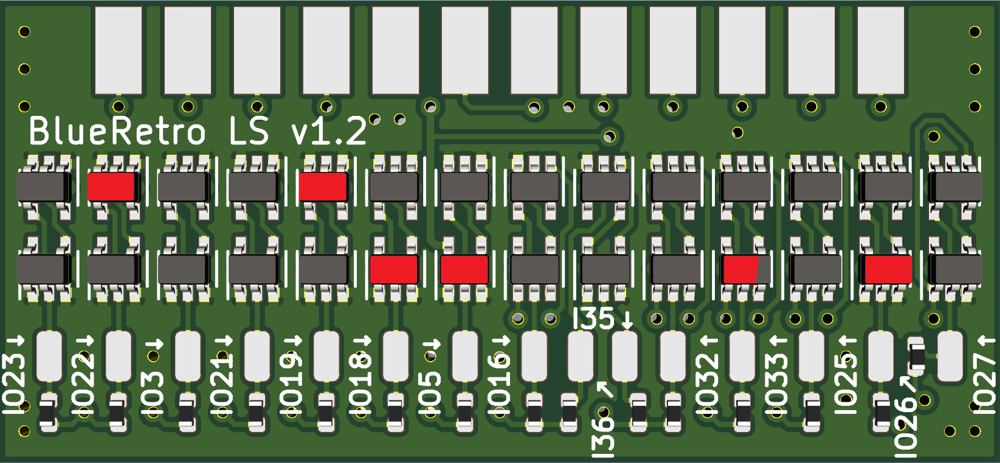
* Solder 74AHCT1G125 to footprint highlighted in red.
* Bridge LO side of jumper I39.
* Connect cords according to table below and pinout reference.

PCB PAD | Cord | Pin | Name | Use | Required?
------- | ---- | --- | ---- | --- | ---------
VIN | PCFX P1 | 1 | 5V | BlueRetro Power | Yes
GND | PCFX P1 | 5 | GND | BlueRetro Power | Yes
GND | PCFX P1 | 7 | GND | BlueRetro Power | Yes
IO33 | PCFX P1 | 4 | /LATCH | Data | Yes
IO5 | PCFX P1 | 6 | CLK | Clock | Yes
IO19 | PCFX P1 | 2 | DATA | Clock | Yes
VIN | PCFX P2 | 1 | 5V | BlueRetro Power | No
GND | PCFX P2 | 5 | GND | BlueRetro Power | No
GND | PCFX P2 | 7 | GND | BlueRetro Power | No
IO26 | PCFX P2 | 4 | /LATCH | Data | No
IO18 | PCFX P2 | 6 | CLK | Clock | No
IO22 | PCFX P2 | 2 | DATA | Clock | No

# JVS adapter cable

## DIY Through-hole

No instruction yet, inspire yourself from the SMD Cable PCB version.

## SMD Cable PCB

### Bill of materials
* DB25 Male solder cup (x1) (DKPN: AE10984-ND PN: A-DS 25 LL/Z)
* DB25 Backshell (x1) (DKPN: 970-25BPE-ND PN: 970-025-010R011)
* 74AHCT1G125 SC70-5 (x1) (DKPN: 296-4709-1-ND PN: SN74AHCT1G125DCKR)
* Step Up 5V (x1) (DKPN: 296-24519-1-ND PN: TPS61240DRVT)
* Inductor (x1) (DKPN: 490-4026-1-ND PN: LQM21FN1R0N00D)
* RS485 PHY (x1) (DKPN: 296-50395-1-ND PN: THVD1450DR)
* Resistor 10K (x2) (DKPN: 311-10.0KLRCT-ND PN: RC0402FR-0710KL)
* Capacitor 0.1u (x1) (DKPN: 490-6328-1-ND PN: GRM155R71C104KA88J)
* Capacitor 2.2u (x1) (DKPN: 1276-1085-1-ND PN: CL10A225KP8NNNC)
* Capacitor 4.7u (x1) (DKPN: 1276-1044-1-ND PN: CL10A475KP8NNNC)
* JVS PCB (x1)
* USB-A plug (x1)

### Cable schematic
[https://github.com/darthcloud/BlueRetroHW/blob/master/Cables/jvs/jvs.pdf](https://github.com/darthcloud/BlueRetroHW/blob/master/Cables/jvs/jvs.pdf)

### Assembly instructions
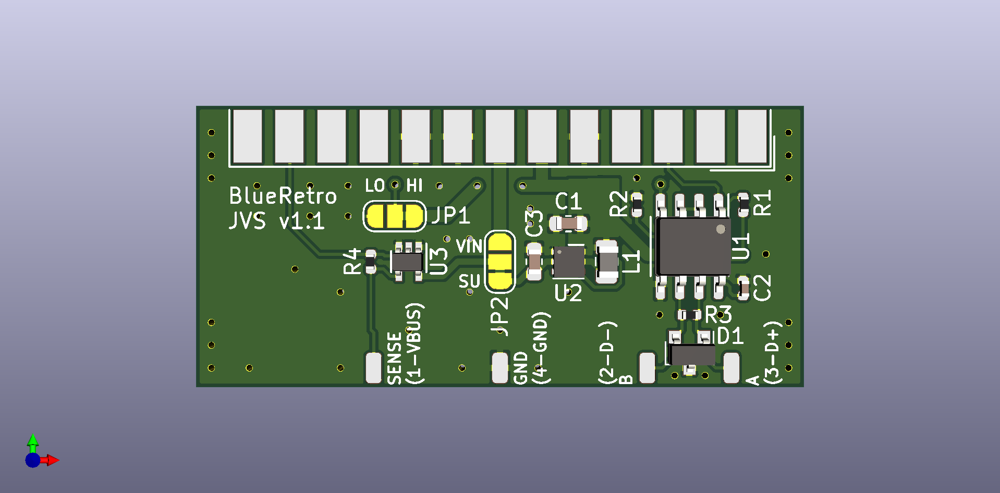
* PCB jumper are already set nothing to do.
* Do not install R4, R3 & D1.
* Connect cords according to table below and pinout reference.

PCB PAD | Cord | Pin | Name | Use | Required?
------- | ---- | --- | ---- | --- | ---------
SENSE (1-VBUS) | USB | 1 | SENSE | JVS Sense | Yes
B (2-D-) | USB | 2 | B | JVS RS485 Data- | Yes
A (3-D+) | USB | 3 | A | JVS RS485 Data+ | Yes
GND (4-GND) | USB | 4 | GND | BlueRetro Power ref | Yes

# Virtual Boy adapter cable

No auto detection in universal FW, configure Virtual Boy system in web or use dedicated FW.

## Pinout reference
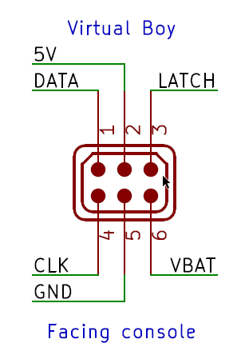

## DIY Through-hole

### Bill of materials
* DB25 Male solder cup (x1) (DKPN: AE10984-ND PN: A-DS 25 LL/Z)
* 74AHCT125N DIP14 (x2) (DKPN: 296-4655-5-ND PN: SN74AHCT125N)
* DB25 Backshell (x1) (DKPN: 970-25BPE-ND PN: 970-025-010R011)
* VB controller plug
* Barrel jack 5.5mm/2.1mm (DKPN: 839-1291-ND PN: 54-00063)
* SPST switch
* 1N5400 diode (DKPN: 1N5400RLGOSCT-ND PN: 1N5400RLG)
* 9V PSU 5.5mm/2.1mm center positive (DKPN: 993-1344-ND PN: PSAC30U-090L6)

### Cable schematic
 [https://github.com/darthcloud/BlueRetroHW/blob/master/DIY/VB.pdf](https://github.com/darthcloud/BlueRetroHW/blob/master/DIY/VB.pdf)

## SMD Cable PCB

### Bill of materials
* DB25 Male solder cup (x1) (DKPN: AE10984-ND PN: A-DS 25 LL/Z)
* 74AHCT1G125 SC70-5 (x3) (DKPN: 296-4709-1-ND PN: SN74AHCT1G125DCKR)
* DB25 Backshell (x1) (DKPN: 970-25BPE-ND PN: 970-025-010R011)
* Level shifter PCB (x1)
* VB controller plug
* Barrel jack 5.5mm/2.1mm (DKPN: 839-1291-ND PN: 54-00063)
* SPST switch
* 1N5400 diode (DKPN: 1N5400RLGOSCT-ND PN: 1N5400RLG)
* 9V PSU 5.5mm/2.1mm center positive (DKPN: 993-1344-ND PN: PSAC30U-090L6)

### Assembly instructions
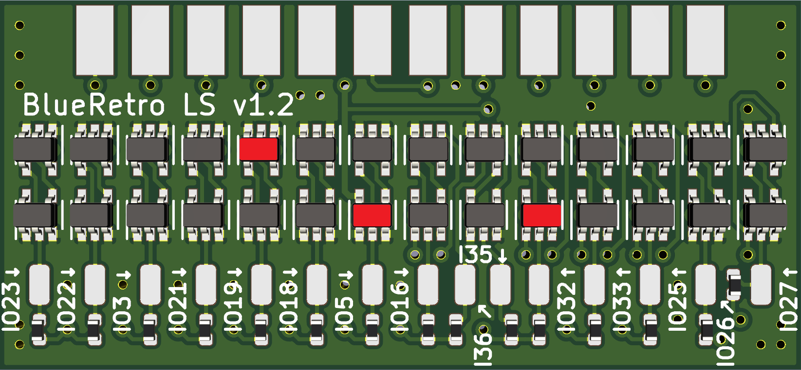
* Solder 74AHCT1G125 to footprint highlighted in red.
* Bridge LO side of jumper I39.
* Connect pad DIR3 & DIR1 to GND.
* Connect cords according to table below and pinout reference.

PCB PAD | Cord | Pin | Name | Use | Required?
------- | ---- | --- | ---- | --- | ---------
VIN | VB P1 | 2 | 5V | BlueRetro Power | Yes
GND | VB P1 | 5 | GND | BlueRetro Power | Yes
IO5 | VB P1 | 4 | CLK | Clock | Yes
IO32 | VB P1 | 3 | LATCH | Latch | Yes
IO19 | VB P1 | 1 | DATA | Data | Yes

# Nintendo 64 adapter cable

## Pinout reference
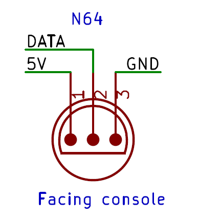

## DIY Through-hole

### Bill of materials
* DB25 Male solder cup (x1) (DKPN: AE10984-ND PN: A-DS 25 LL/Z)
* DB25 Backshell (x1) (DKPN: 970-25BPE-ND PN: 970-025-010R011)
* N64 controller plug (x4)

### Cable schematic
 [https://github.com/darthcloud/BlueRetroHW/blob/master/DIY/N64.pdf](https://github.com/darthcloud/BlueRetroHW/blob/master/DIY/N64.pdf)

### Assembly instructions
* If using an universal FW, make sure to connect I39 to 3.3V and IO21, IO22, IO25, IO32, IO33, I34 & I35 to GND.
* If not wiring 2nd port plug, make sure to connect IO5 (P2_D) to 3.3V
* If not wiring 3rd port plug, make sure to connect IO26 (P3_D) to 3.3V
* If not wiring 4th port plug, make sure to connect IO27 (P4_D) to 3.3V

## SMD Cable PCB

### Bill of materials
* DB25 Male solder cup (x1) (DKPN: AE10984-ND PN: A-DS 25 LL/Z)
* DB25 Backshell (x1) (DKPN: 970-25BPE-ND PN: 970-025-010R011)
* Passthrough PCB (x1)
* N64 controller plug (x4)

### Assembly instructions

* Bridge HI side of jumper I39.
* Connect cords according to table below and pinout reference.

PCB PAD | Cord | Pin | Name | Use | Required?
------- | ---- | --- | ---- | --- | ---------
VIN | N64 P1 | 1 | 3.3V | BlueRetro Power | Yes
IO19 | N64 P1 | 2 | P1_D | Player 1 DATA | Yes
GND | N64 P1 | 3 | GND | BlueRetro Power | Yes
VIN | N64 P2 | 1 | 3.3V | BlueRetro Power | No
IO5 | N64 P2 | 2 | P2_D | Player 2 DATA | No
GND | N64 P2 | 3 | GND | BlueRetro Power | No
VIN | N64 P3 | 1 | 3.3V | BlueRetro Power | No
IO26 | N64 P3 | 2 | P3_D | Player 3 DATA | No
GND | N64 P3 | 3 | GND | BlueRetro Power | No
VIN | N64 P4 | 1 | 3.3V | BlueRetro Power | No
IO27 | N64 P4 | 2 | P4_D | Player 4 DATA | No
GND | N64 P4 | 3 | GND | BlueRetro Power | No

# Dreamcast adapter cable

** If 2nd port is not working, remove jumper on UART connector for IO3 (RXD).**

## Pinout reference
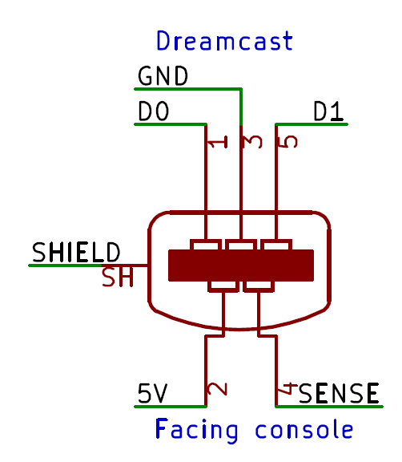

## DIY Through-hole

### Bill of materials
* DB25 Male solder cup (x1) (DKPN: AE10984-ND PN: A-DS 25 LL/Z)
* DB25 Backshell (x1) (DKPN: 970-25BPE-ND PN: 970-025-010R011)
* Dreamcast controller plug (x4)

### Cable schematic
 [https://github.com/darthcloud/BlueRetroHW/blob/master/DIY/Dreamcast.pdf](https://github.com/darthcloud/BlueRetroHW/blob/master/DIY/Dreamcast.pdf)

### Assembly instructions
* If using an universal FW, make sure to connect I39 to 3.3V and IO25, IO32, IO33, I34 & I35 to GND.
* If not wiring 2nd port plug, make sure to connect IO3 (P2_D0) & IO5 (P2_D1) to 3.3V
* If not wiring 3rd port plug, make sure to connect IO18 (P3_D0) & IO23 (P3_D1) to 3.3V
* If not wiring 4th port plug, make sure to connect IO26 (P4_D0) & IO27 (P4_D1) to 3.3V

## SMD Cable PCB

### Bill of materials
* DB25 Male solder cup (x1) (DKPN: AE10984-ND PN: A-DS 25 LL/Z)
* DB25 Backshell (x1) (DKPN: 970-25BPE-ND PN: 970-025-010R011)
* Passthrough PCB (x1)
* Dreamcast controller plug (x4)

### Assembly instructions
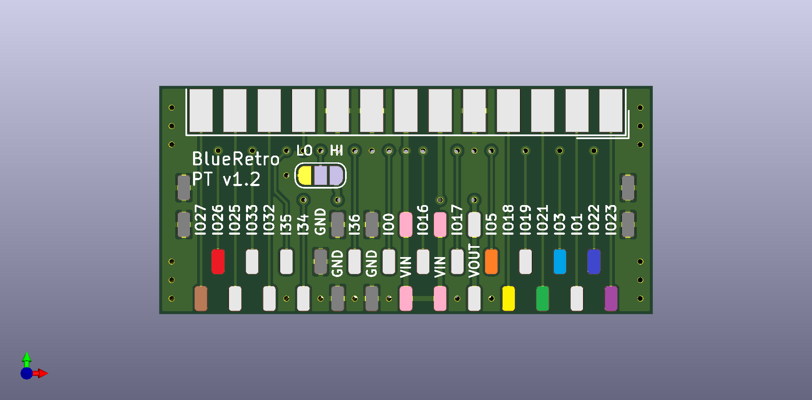
* Bridge HI side of jumper I39.
* Connect cords according to table below and pinout reference.

PCB PAD | Cord | Pin | Name | Use | Required?
------- | ---- | --- | ---- | --- | ---------
VIN | DC P1 | 2 | 5V | BlueRetro Power | Yes
IO21 | DC P1 | 1 | P1_D0 | Player 1 DATA0 | Yes
IO22 | DC P1 | 5 | P1_D1 | Player 1 DATA1 | Yes
GND | DC P1 | 3, 4, SH | GND | BlueRetro Power | Yes
VIN | DC P2 | 2 | 5V | BlueRetro Power | No
IO3 | DC P2 | 1 | P2_D0 | Player 2 DATA0 | No
IO5 | DC P2 | 5 | P2_D1 | Player 2 DATA1 | No
GND | DC P2 | 3, 4, SH | GND | BlueRetro Power | No
VIN | DC P3 | 2 | 5V | BlueRetro Power | No
IO18 | DC P3 | 1 | P3_D0 | Player 3 DATA0 | No
IO23 | DC P3 | 5 | P3_D1 | Player 3 DATA1 | No
GND | DC P3 | 3, 4, SH | GND | BlueRetro Power | No
VIN | DC P4 | 2 | 5V | BlueRetro Power | No
IO26 | DC P4 | 1 | P4_D0 | Player 4 DATA0 | No
IO27 | DC P4 | 5 | P4_D1 | Player 4 DATA1 | No
GND | DC P4 | 3, 4, SH | GND | BlueRetro Power | No

# GameCube adapter cable

## Pinout reference

## DIY Through-hole

### Bill of materials
* DB25 Male solder cup (x1) (DKPN: AE10984-ND PN: A-DS 25 LL/Z)
* DB25 Backshell (x1) (DKPN: 970-25BPE-ND PN: 970-025-010R011)
* GameCube controller plug (x4)

### Cable schematic
 [https://github.com/darthcloud/BlueRetroHW/blob/master/DIY/GameCube.pdf](https://github.com/darthcloud/BlueRetroHW/blob/master/DIY/GameCube.pdf)

### Assembly instructions
* If using an universal FW, make sure to connect I39 to GND and IO21, IO22, IO25, IO32, IO33, I34 & I35 to GND.
* If not wiring 2nd port plug, make sure to connect IO5 (P2_D) to 3.3V
* If not wiring 3rd port plug, make sure to connect IO26 (P3_D) to 3.3V
* If not wiring 4th port plug, make sure to connect IO27 (P4_D) to 3.3V

## SMD Cable PCB

### Bill of materials
* DB25 Male solder cup (x1) (DKPN: AE10984-ND PN: A-DS 25 LL/Z)
* DB25 Backshell (x1) (DKPN: 970-25BPE-ND PN: 970-025-010R011)
* Passthrough PCB (x1)
* GameCube controller plug (x4)

### Assembly instructions
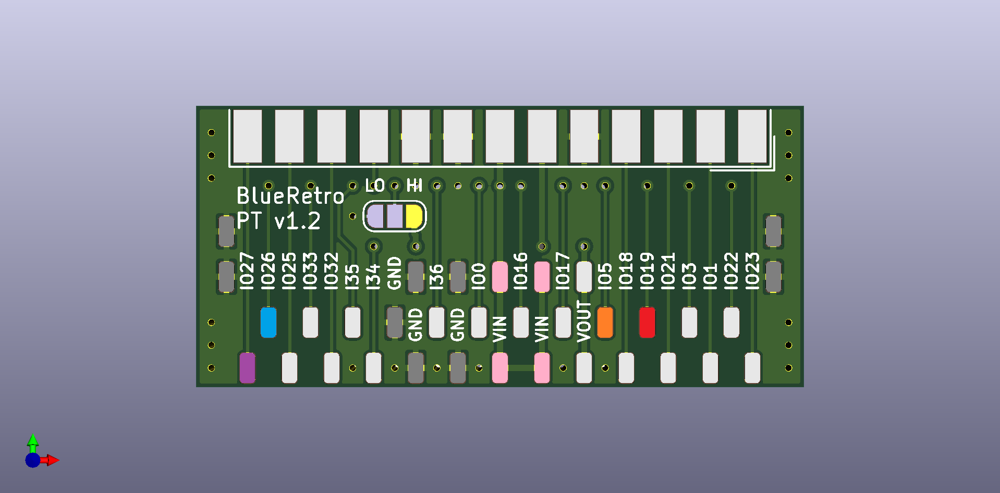
* Bridge LO side of jumper I39.
* Connect cords according to table below and pinout reference.

PCB PAD | Cord | Pin | Name | Use | Required?
------- | ---- | --- | ---- | --- | ---------
VIN | GC P1 | 1 | 5V | BlueRetro Power | Yes
IO19 | GC P1 | 2 | P1_D | Player 1 DATA | Yes
GND | GC P1 | 3, 4, SH | GND | BlueRetro Power | Yes
VIN | GC P2 | 1 | 5V | BlueRetro Power | No
IO5 | GC P2 | 2 | P2_D | Player 2 DATA | No
GND | GC P2 | 3, 4, SH | GND | BlueRetro Power | No
VIN | GC P3 | 1 | 5V | BlueRetro Power | No
IO26 | GC P3 | 2 | P3_D | Player 3 DATA | No
GND | GC P3 | 3, 4, SH | GND | BlueRetro Power | No
VIN | GC P4 | 1 | 5V | BlueRetro Power | No
IO27 | GC P4 | 2 | P4_D | Player 4 DATA | No
GND | GC P4 | 3, 4, SH | GND | BlueRetro Power | No
