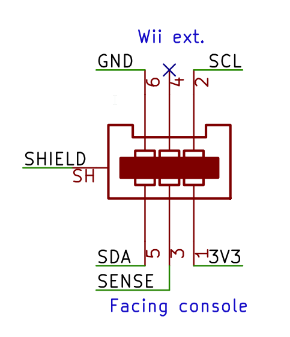

# Table of contents
* [Parallel 1P (12 buttons) (NeoGeo, Supergun, JAMMA)](#parallel-1p-5v-12-buttons)
* [Parallel 2P (6 buttons each) (Atari 2600, Master System)](#parallel-2p-5v-6-buttons-each)
* [FC / NES](#fc--nes)
* [PCE / TG16](#pce--tg16)
* [Mega Drive / Genesis](#mega-drive--genesis)
* [SFC / SNES](#sfc--snes)
* [CD-i](#cd-i)
* [3DO](#3do)
* [Jaguar](#jaguar)
* [PSX / PS2](#psx--ps2)
* [Saturn](#saturn)
* [PC-FX](#pc-fx)
* [JVS](#jvs)
* [Virtual Boy](#virtual-boy)
* [Nintendo 64](#nintendo-64)
* [Dreamcast](#dreamcast)
* [GameCube](#gamecube)
* [Wii-Ext](#wii-ext)

# Parallel 1P 5V (12 buttons)

ESP32 IO | System Pin | Name | Use
-------- | ---------- | ---- | ---
IO5 | 7 | DOWN | Player 1 BTN
IO3 | 15 | UP | Player 1 BTN
IO27 | 5 | B | Player 1 BTN
IO26 | 13 | A | Player 1 BTN
IO23 | 6 | RIGHT | Player 1 BTN
IO18 | 14 | LEFT | Player 1 BTN
IO21 | 4 | D | Player 1 BTN
IO19 | 12 | C | Player 1 BTN
IO32 | 11 | START | Player 1 BTN
IO33 | 2 | CREDIT | Player 1 BTN
IO25 | 10 | 6 | Player 1 BTN
IO22 | 3 | SELECT | Player 1 BTN

# Parallel 2P 5V (6 buttons each)

\

ESP32 IO | System Pin | Name | Use
-------- | ---------- | ---- | ---
IO5 | 2 | P1_D | Player 1 D1
IO3 | 1 | P1_U | Player 1 D0
IO27 | 9 | P1_TR | Player 1 D4
IO26 | 6 | P1_TL | Player 1 D5
IO23 | 4 | P1_R | Player 1 D3
IO18 | 3 | P1_L | Player 1 D2
IO21 | 2 | P2_D | Player 2 D1
IO19 | 1 | P2_U | Player 2 D0
IO16 | 9 | P2_TR | Player 2 D4
IO33 | 6 | P2_TL | Player 2 D5
IO25 | 4 | P2_R | Player 2 D3
IO22 | 3 | P2_L | Player 2 D2

# FC / NES

ESP32 IO | System Pin | Name | Use
-------- | ---------- | ---- | ---
IO32 | 3 | OUT0 | Latch for all accessories
IO19 | 4 | P1_D0 | Player 1 / Four Score DATA
IO5 | 2 | P1_CUP | Player 1 / Four Score CLK
IO22 | 4 | P2_D0 | Player 2 / Four Score DATA
IO18 | 2 | P2_CUP | Player 2 / Four Score CLK
IO21 | 13 | P1_D1 | FC 4P adapter P3 DATA
IO25 | 7 | P2_D1 | FC 4P adapter P4 DATA

# PCE / TG16

ESP32 IO | System Pin | Name | Use
-------- | ---------- | ---- | ---
IO3 | 2 | P1_U | Player 1 D0
IO5 | 3 | P1_R | Player 1 D1
IO18 | 4 | P1_D | Player 1 D2
IO23 | 5 | P1_L | Player 1 D3
I33 | 6 | P1_SEL | Player 1 SEL
IO26 | 7 | P1_OE | Player 1 /OE

# Mega Drive / Genesis

ESP32 IO | System Pin | Name | Use
-------- | ---------- | ---- | ---
IO5 | 2 | P1_D | Player 1 D1
IO3 | 1 | P1_U | Player 1 D0
I35 | 7 | P1_TH | Player 1 CTRL
IO27 | 9 | P1_TR | Player 1 D4/CTRL
IO26 | 6 | P1_TL | Player 1 D5/CTRL
IO23 | 4 | P1_R | Player 1 D3
IO18 | 3 | P1_L | Player 1 D2
IO21 | 2 | P2_D | Player 2 D1
IO19 | 1 | P2_U | Player 2 D0
I36 | 7 | P2_TH | Player 2 CTRL
IO16 | 9 | P2_TR | Player 2 D4/CTRL
IO33 | 6 | P2_TL | Player 2 D5/CTRL
IO25 | 4 | P2_R | Player 2 D3
IO22 | 3 | P2_L | Player 2 D2

# SFC / SNES

ESP32 IO | System Pin | Name | Use
-------- | ---------- | ---- | ---
IO5 | 2 | P1_CLK | Player 1 / Multitap 1 CLK
IO32 | 3 | LATCH | Latch for all accessories
IO19 | 4 | P1_D0 | Player 1 / Multitap 1 DATA
IO21 | 5 | P1_D1 | Multitap 1 DATA
IO23 | 6 | P1_SEL | Multitap 1 CTRL
IO18 | 2 | P2_CLK | Player 2 / Multitap 2 CLK
IO22 | 4 | P2_D0 | Player 2 / Multitap 2 DATA
IO25 | 5 | P2_D1 | Multitap 2 DATA
IO26 | 6 | P2_SEL | Multitap 2 CTRL

# CD-i

ESP32 IO | System Pin | Name | Use
-------- | ---------- | ---- | ---
IO23 | 7 | RTS | Enable
IO22 | 2 | RXD | Data
IO21 | Front: 4 or Rear: 7 | RTS | Enable
IO19 | Front: 1 or Rear: 2 | RXD | Data

# 3DO

ESP32 IO | System Pin | Name | Use
-------- | ---------- | ---- | ---
IO21 | 9 | DIN | Data
IO22 | 7 | CLK | Clock

# Jaguar

ESP32 IO | System Pin | Name | Use
-------- | ---------- | ---- | ---
IO18 | 14 | J8 | Player 1 ROW OUT
IO19 | 13 | J9 | Player 1 ROW OUT
IO21 | 12 | J10 | Player 1 ROW OUT
IO22 | 11 | J11 | Player 1 ROW OUT
IO23 | 10 | B1 | Player 1 ROW OUT
IO25 | 6 | B0 | Player 1 ROW OUT
IO32 | 4 | J0 | Player 1 COL IN
IO33 | 3 | J1 | Player 1 COL IN
I35 | 2 | J2 | Player 1 COL IN
I36 | 1 | J3 | Player 1 COL IN

# PSX / PS2

ESP32 IO | System Pin | Name | Use
-------- | ---------- | ---- | ---
IO19 | 1 | P1_RXD | Player 1 DATA
IO32 | 2 | P1_TXD | Player 1 CMD
I34 | 6 | P1_DTR | Player 1 CS
IO33 | 7 | P1_SCK | Player 1 CLK
IO21 | 9 | P1_DSR | Player 1 ACK
IO22 | 1 | P2_RXD | Player 2 DATA
IO27 | 2 | P2_TXD | Player 2 CMD
IO5 | 6 | P2_DTR | Player 2 CS 
IO26 | 7 | P2_SCK | Player 2 CLK
IO25 | 9 | P2_DSR | Player 2 ACK

# Saturn

ESP32 IO | System Pin | Name | Use
-------- | ---------- | ---- | ---
IO5 | 2 | P1_D | Player 1 D1
IO3 | 3 | P1_U | Player 1 D0
I35 | 4 | P1_TH | Player 1 CTRL
IO27 | 5 | P1_TR | Player 1 CTRL
IO26 | 6 | P1_TL | Player 1 CTRL
IO23 | 7 | P1_R | Player 1 D3
IO18 | 8 | P1_L | Player 1 D2
IO21 | 2 | P2_D | Player 2 D1
IO19 | 3 | P2_U | Player 2 D0
I36 | 4 | P2_TH | Player 2 CTRL
IO16 | 5 | P2_TR | Player 2 CTRL
IO33 | 6 | P2_TL | Player 2 CTRL
IO25 | 7 | P2_R | Player 2 D3
IO22 | 8 | P2_L | Player 2 D2

# PC-FX

ESP32 IO | System Pin | Name | Use
-------- | ---------- | ---- | ---
IO33 | 4 | /LATCH | Data
IO5 | 6 | CLK | Clock
IO19 | 2 | DATA | Clock
IO26 | 4 | /LATCH | Data
IO18 | 6 | CLK | Clock
IO22 | 2 | DATA | Clock

# JVS

ESP32 IO  | Name | Use
-------- | ---- | ---
IO25 | SENSE | JVS Sense
IO22 | TX | UART TX
IO21 | RX | UART RX
IO19 | RTS | RS-485 direction control

# Virtual Boy

ESP32 IO | System Pin | Name | Use
-------- | ---------- | ---- | ---
IO5 | 4 | CLK | Clock
IO32 | 3 | LATCH | Latch
IO19 | 1 | DATA | Data

# Nintendo 64

ESP32 IO | System Pin | Name | Use
-------- | ---------- | ---- | ---
IO19 | 2 | P1_D | Player 1 DATA
IO5 | 2 | P2_D | Player 2 DATA
IO26 | 2 | P3_D | Player 3 DATA
IO27 | 2 | P4_D | Player 4 DATA

# Dreamcast

ESP32 IO | System Pin | Name | Use
-------- | ---------- | ---- | ---
IO21 | 1 | P1_D0 | Player 1 DATA0
IO22 | 5 | P1_D1 | Player 1 DATA1
IO3 | 1 | P2_D0 | Player 2 DATA0
IO5 | 5 | P2_D1 | Player 2 DATA1
IO18 | 1 | P3_D0 | Player 3 DATA0
IO23 | 5 | P3_D1 | Player 3 DATA1
IO26 | 1 | P4_D0 | Player 4 DATA0
IO27 | 5 | P4_D1 | Player 4 DATA1

# GameCube

ESP32 IO | System Pin | Name | Use
-------- | ---------- | ---- | ---
IO19 | 2 | P1_D | Player 1 DATA
IO5 | 2 | P2_D | Player 2 DATA
IO26 | 2 | P3_D | Player 3 DATA
IO27 | 2 | P4_D | Player 4 DATA

# Wii-Ext

ESP32 IO | System Pin | Name | Use
-------- | ---------- | ---- | ---
IO25 | 2 | P1_SCL | Player 1 CLK
IO26 | 5 | P1_SDA | Player 1 DATA
IO5 | 2 | P2_SCL | Player 2 CLK
IO27 | 5 | P2_SDA | Player 2 DATA

