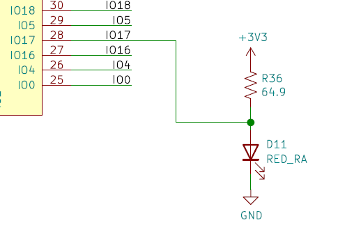
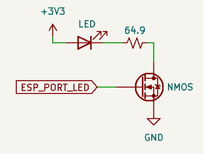

## Bill of materials
* ESP32-DEVKITC-32E with ESP-WROOM-32 (Get it on [Digikey](https://www.digikey.com/en/products/detail/espressif-systems/ESP32-DEVKITC-32E/12091810?s=N4IgTCBcDaIKYGcAOBmMBaAJnAbgawEsAXAY3TThAF0BfIA) or [Mouser](https://www.mouser.com/ProductDetail/Espressif-Systems/ESP32-DevKitC-32E?qs=sGAEpiMZZMv0NwlthflBi3XYxq%252BTapwyHnR2%2FrAf4bY%3D))
* DB-25 Female connector solder cup (or console plug if hardwired)

## Build instructions

1. Install [esptool](https://github.com/espressif/esptool) and prerequisites (not required for Windows):

    **Linux:** [Install prerequisites](https://docs.espressif.com/projects/esp-idf/en/latest/esp32/get-started/linux-setup.html).
    
    **macOS:** [Install prerequisites](https://docs.espressif.com/projects/esp-idf/en/latest/esp32/get-started/macos-setup.html) and [USB driver](https://www.silabs.com/developers/usb-to-uart-bridge-vcp-drivers) (Note: You may need to Allow driver under System Preferences > Security & Privacy, and reboot).

    Then run:
    
     ```
     pip install esptool
     ```
  
2. Download latest BlueRetro binary from [GitHub](https://github.com/darthcloud/BlueRetro/releases) and flash them on your ESP32.

    **Linux/macOS:**
    [Find your device path](https://docs.espressif.com/projects/esp-idf/en/latest/esp32/get-started/establish-serial-connection.html) which should look like `/dev/tty*` on Linux or `/dev/cu.*` on macOS. Then run the following (changing `/dev/ttyUSB0` to your actual device):
  
    ```
    esptool.py -p /dev/ttyUSB0 \
      -b 460800 --before default_reset --after hard_reset --chip esp32 \
      write_flash --flash_mode dio --flash_size detect --flash_freq 40m \
      0x1000 bootloader/bootloader.bin \
      0x8000 partition_table/partition-table.bin \
      0x10000 BlueRetro_universal_spiffs.bin
    ```
    
    **Windows:**
    [Flashing firmware Windows 10](https://github.com/darthcloud/BlueRetro/wiki/Flashing-firmware-Windows-10).

3. Install DB25 connector (or direct console plug).\
https://github.com/darthcloud/BlueRetroHW/blob/master/DIY/BlueRetroDIY.pdf

4. Build target system cable adapter (or use as reference for direct console plug).\
https://github.com/darthcloud/BlueRetro/wiki/BlueRetro-Cables-Build-Instructions

5. (Optional) Power on system and connect via Web Bluetooth to configure adapter.\
   The config mode is only available if no controller is connected. \
https://blueretro.io

6. BlueRetro is always in pairing mode if no controller connected.\
   Pair via inquiry first (SYNC or pairing mode), on subsequent connection you can simply page (button press or power on button).\
   See guide for more specific instruction: [Pairing Guide](https://github.com/darthcloud/BlueRetro/wiki/Controller-pairing-guide)

7. (Optional) Wire IO17 as follow to get Bluetooth pairing mode status and error notification:
   

8. (Optional) Port status LED
   ESP32 IO | Direction | Function | Note
   ---------- | ---------- | --------- | ------
   2 | Output | Controller port 1 LED | 3.3v level
   4 | Output | Controller port 2 LED | 3.3v level
   12* | Output | Controller port 3 LED | 3.3v level
   15* | Output | Controller port 4 LED | 3.3v level

   *In PlayStation mode pin 12 & 15 are used as the P1 & P2 Analog LED respectively.

   All those pin are ESP32 strapping pin. Interface via MOSFET to avoid problem at boot.

   

   8.1. Behavior while in pairing mode\
        The first available port LED will be pulsing.

   8.2. Behavior when BT controller connected\
        Port which got an active BT connection will have it's corresponding LED solid.

   8.3. Behavior while system reset is pressed (Boot button)\
        All port LED are used to indicate current switch function.
