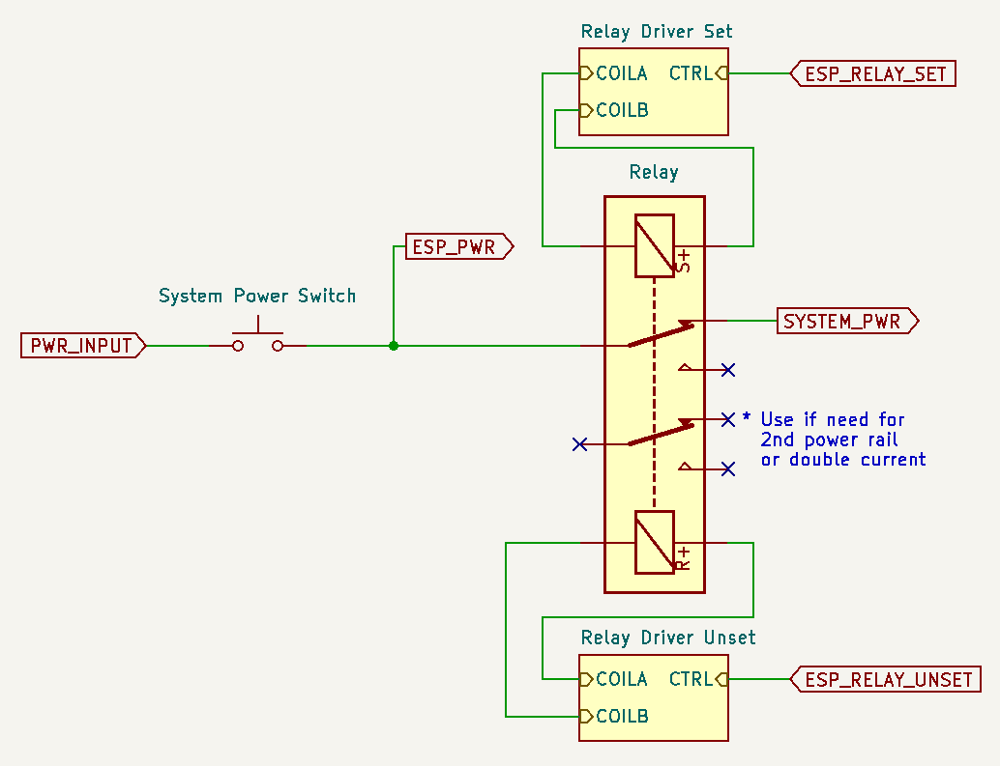
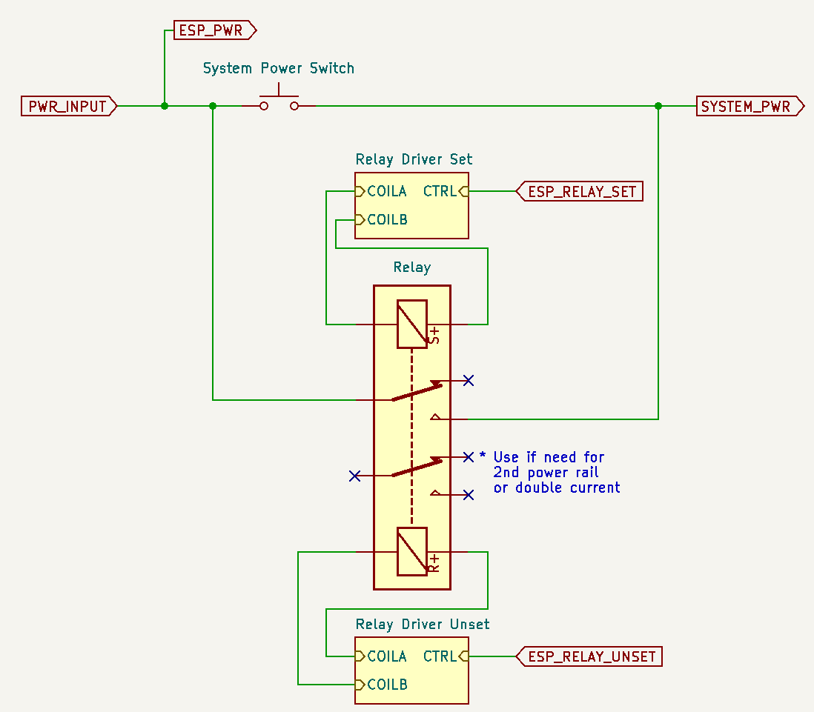
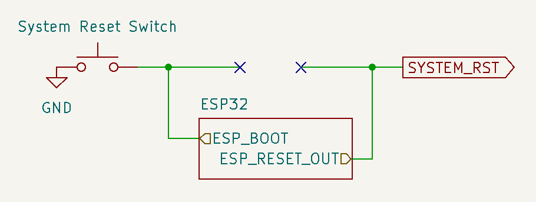
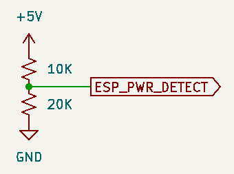
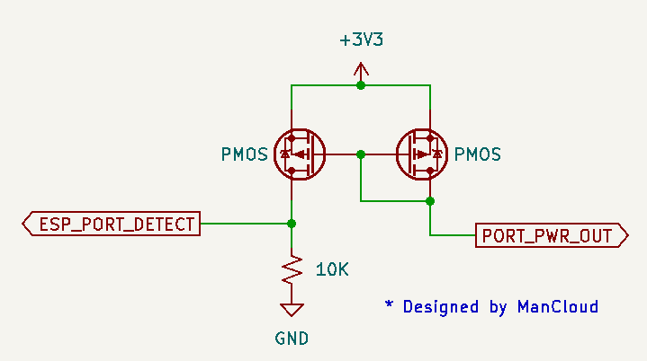
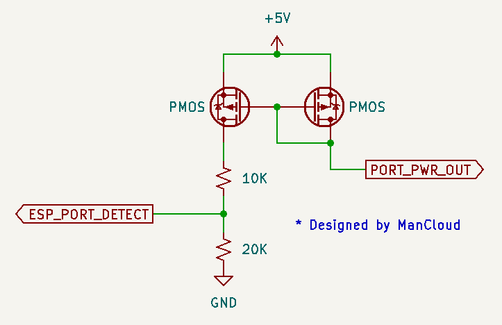
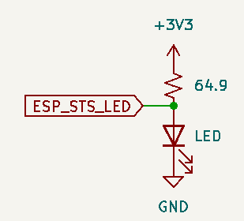

# This is not a modding guide. While all the information is listed, you need to be experienced in electronic to make use of this information.

# Table of contents
* [1 - ESP32 power source](#1---esp32-power-source)
* [2 - Power switch & relay](#2---power-switch--relay)
* [3 - Reset button](#3---reset-button)
* [4 - Console power detection](#4---console-power-detection)
* [5 - Controller port detection](#5---controller-port-detection)
* [6 - Bus conflict mitigation](#6---bus-conflict-mitigation)
* [7 - Port status LED](#7---port-status-led)
* [8 - Global status LED](#8---global-status-led)
* [9 - Wired interface pinout](#9---wired-interface-pinout)
* [10 - Example schematic base on spec](#10---example-schematic-base-on-spec)

# 1 - ESP32 power source
The ESP32 needs to be always ON to be able to power up the system on Bluetooth connection.

### Option 1: System with DC input
* Simply power the ESP LDO directly from the DC input.

### Option 2: System with AC input
* Use a circuit similar to a USB wall adapter to get a 5V source.
* Replacing system PSU with one who use a DC input.

# 2 - Power switch & relay
ESP32 IO | Direction | Function | Note
---------- | ---------- | --------- | ------
13 | Output | Relay Set / Power set | Idle low, set high 20ms
16* | Output | Relay Unset | Idle low, set high 20ms

```
* Relay Unset pin # for Mega Drive / Genesis / Saturn is IO12 due to conficts
```

Use a dual coil latching relay.
Multiple relays or a relay with multi pole might be required for system with more than one supply voltage.

### Option 1: Relay wired in series
The relay is wired in series after the system power switch.

Pro:
* It's is possible for the user to completely turn off console, including the ESP32.

Con:
* The power switch now become a "hard" power switch. The reset button is now used as a "soft" power switch.



### Option 2: Relay wired in parallel
The relay is wired in parallel with the system power switch.

Pro:
* Power switch can be used as usual in addition to powering via the relay (BT connect or reset switch)

Con:
* Turning off the ESP32 require pulling the power cord.



### Option 3: Logic signal
Only possible for system where power on is controlled by a logic digital signal. Only IO13 is used in this case.


# 3 - Reset button
ESP32 IO | Direction | Function | Note
---------- | ---------- | --------- | ------
0 | Input | ESP32 boot button | Idle high
14 | Output | System reset | polarity varies base on system

In an internal install, the ESP32 boot button take over the system physical reset switch.
The original system reset signal is managed by the ESP32.

If the system logic is 3V3, the ESP32 output pin is set to open drain.

If the system logic is 5V, a 3 state buffer need to be used. It's wired so the ESP32 control it's /OE line to toggle between LO and High-Z state.



### System reset behavior while ESP32 off & system off
* Holding system reset and then powering system put the ESP32 in boot (download) mode. Effectively disabling it for the current power session.

### System reset behavior while ESP32 on & system off
* System is powered on via power relay / power pin

### System reset behavior while ESP32 on and system on
* Button press under < 3 sec (All LEDs solid):
  Usual system reset.
* Button press between > 3 sec and < 6 sec (All LEDs blink slowly):
  If in pairing mode: Stop pairing mode otherwise all BT devices are disconnect.
* Button press between > 6 sec and < 10 sec (All LEDs blink fast):
  Start pairing mode.
* Button press over > 10 sec (All LEDs blink very fast):
  Factory reset ESP32 to original BlueRetro firmware the device shipped with & reset configuration.

### System reset behavior while ESP32 off and system on
* While the ESP32 is in boot mode or in deep sleep the system reset function is lost.

# 4 - Console power detection
ESP32 IO | Direction | Function | Note
---------- | ---------- | --------- | ------
39 (VN) | Input | System power detection | 3.3v level

Connected directly to system 3.3v power rail.

For 5V system use a voltage divider:



# 5 - Controller port detection
ESP32 IO | Direction | Function | Note
---------- | ---------- | --------- | ------
35* | Input | Controller port 1 detect | 3.3v level, low: port used, high: port free
36** | Input | Controller port 2 detect | 3.3v level, low: port used, high: port free
32 | Input | Controller port 3 detect | 3.3v level, low: port used, high: port free
33 | Input | Controller port 4 detect | 3.3v level, low: port used, high: port free

```
* P1 pin # for Mega Drive / Genesis / Saturn / Jaguar is IO15 due to conficts
** P2 pin # for Mega Drive / Genesis / Saturn / Jaguar is I34 due to conficts
```

To avoid original wired controller and BlueRetro from interfering each other on the controller bus, some sort of mechanism need to be used to drive the corresponding port detection pin.

### Option 1: Use existing system controller detection pin
Only for Wii extension based system like NES & SNES classic

### Option 2: Use port shield
For system with port using a shield: GameCube

This require isolating each port shield from the system GND and connecting each port shield to the corresponding detect pin on the ESP32. Each pin need a 10K pull-up resistor as well.

### Option 3: Add switch inside port
Mainly for system with big plastic connector: N64

Drill small hole in each connector outer edge receptacle and attach a SPST switch to it in a way that the controller plug close it once fully inserted. Connect one of the switch pin to GND and the other to the corresponding detection pin. Each pin need a 10K pull-up resistor as well.

### Option 4: Use a current mirror
The current mirror circuit allow to detect connected wired controller by measuring current draw from the port.
Good for any system which controller draw at least 500 uA.

This require isolating the power pin of the connector and placing the current mirror circuit between the port and system power rail.

See ManCloud's repo for more info: https://github.com/ManCloud/CurrentTrigger

 

# 6 - Bus conflict mitigation

### 3V3 level bus
(PS1, PS2, N64, GC, DC)
BlueRetro firmware will make sure to prevent bus conflict by setting it's output pin as input (High impedance) when wired connection is detected.

### 5V level bus (Push-Pull)
Those systems require the usage of level shifter, as such their OE pin is then used to prevent bus conflict for the output pins.
BlueRetro FW will not take any action to avoid bus conflicts on those systems.

Simply connect the port detection logic output for one port to each of the OE line that control an output for that port.

Since the port detection logic is HIGH for using BlueRetro data, 74AHCT126N (or single gate 74AHCT1G126 variant) need to be used as their OE line is not inverted.

### 5V level bus (Open-drain)
(Parallel 1P & 2P)
No action required, since the idle state high is driven by the console own internal pull-up, no conflict will occur if BT and wired controller are not actively used simultaneously.

# 7 - Port status LED
ESP32 IO | Direction | Function | Note
---------- | ---------- | --------- | ------
2 | Output | Controller port 1 LED | 3.3v level
4 | Output | Controller port 2 LED | 3.3v level
12* | Output | Controller port 3 LED | 3.3v level
15* | Output | Controller port 4 LED | 3.3v level

*In PlayStation mode pin 12 & 15 are used as the P1 & P2 Analog LED respectively.

All those pin are ESP32 strapping pin. Interface via MOSFET to avoid problem at boot.


### Behavior while in pairing mode
* The first available port LED will be pulsing.

### Behavior when BT controller connected
* Port which got an active BT connection will have it's corresponding LED solid.

### Behavior while system reset is pressed (Boot button)
* All port LED are used to indicate current switch function (See [3](#system-reset-behavior-while-esp32-on-and-system-on))

# 8 - Global status LED
ESP32 IO | Direction | Function | Note
---------- | ---------- | --------- | ------
17 | Output | BlueRetro status LED | 3.3v level



### Behavior while in pairing mode
* LED will be pulsing.

### Behavior while system reset is pressed (Boot button)
* LED indicate current switch function (See [3](#system-reset-behavior-while-esp32-on-and-system-on))

### Behavior when an unrecoverable error occur
* LED will be solid.

# 9 - Wired interface pinout
See [BlueRetro Core Pinout Specification](BlueRetro-Core-Pinout-Specification)

# 10 - Example schematic base on spec
* GameCube: [gamecube_hw2_internal.pdf](pdf/gamecube_hw2_internal.pdf)

[Nostalgic Indulgences](https://twitter.com/nosIndulgences) created multiple guides base on HW2 for internal install. Checkout his GitHub repo: https://github.com/nostalgic-indulgences/BlueRetro_Internal_Installation

