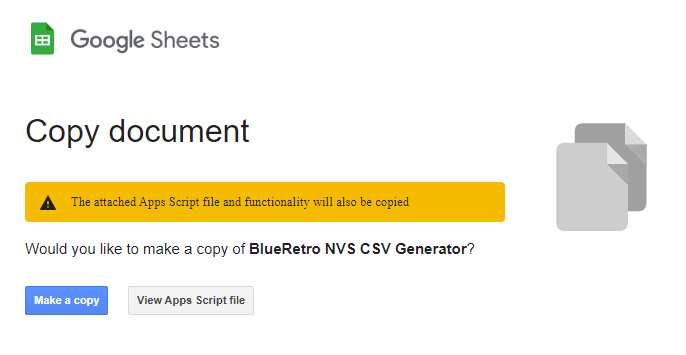
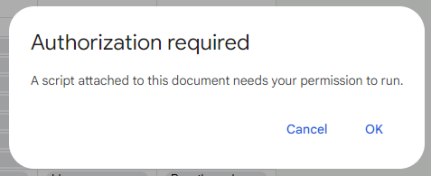
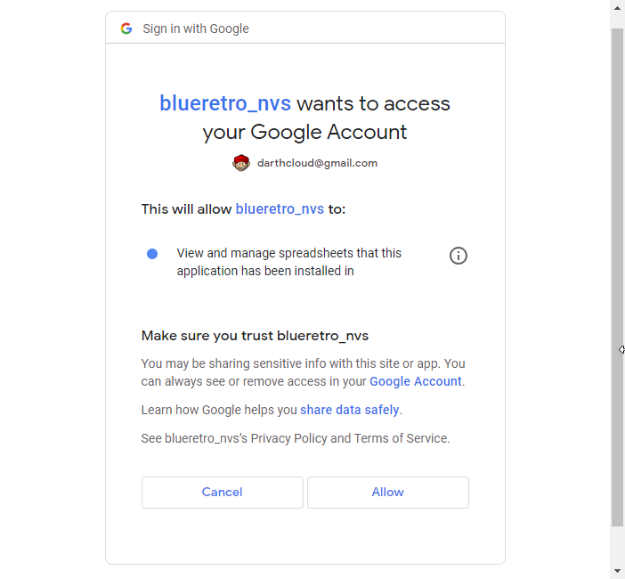
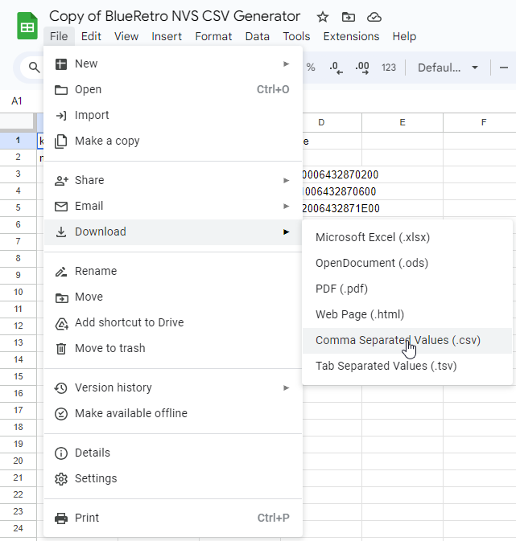
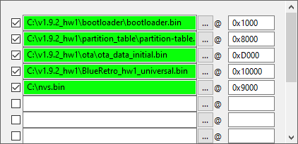

Since firmware v1.9.2 it is possible to modify the default config using NVS flash variables.
These changes are non-volatile and are restored when the user delete the config or perform a factory reset.
The changes are uploaded via an additional binary file using the Flash Download Tool used to program the firmware via USB Serial.

# 1 - Generating the CSV config with the Google sheet

1. Make a copy of the Google sheet to your Google Drive:\
   https://docs.google.com/spreadsheets/d/1qam4NyRg7Pec7PtPjEmYr2pjvLkCnkXyByLVaz7dG30/copy \
   
2. Make changes to the default config in the **Configuration** sheet.
   ```
   Note: Due to NVS partition size limit, only about 75% of the config can be customized.
   ```
3. At the top right corner of the **Configuration** sheet press **Generate CSV**.\
   
4. Click OK on the **Authorization required** window that pop-up.\
   
5. Select your Google account.\
   
6. At the **blueretro_nvs wants to access your Google Account** click **Allow**.\
   
7. At the top right corner of the **Configuration** sheet press **Generate CSV** again.\
   
8. A new sheet named **nvs_csv** will be generated, wait for the script to finish.
9. Click on File->Download->Comma Separated Values (.csv) to download the config in CSV format.\
   
10. Rename the file to **nvs.csv** .

# 2 - Generating the nvs.bin binary from the CSV config

1. Download the following script localy:\
   https://github.com/espressif/esp-idf/blob/master/components/nvs_flash/nvs_partition_generator/nvs_partition_gen.py

2. Install **esp-idf-nvs-partition-gen**:
   ```
   pip install esp-idf-nvs-partition-gen
   ```
3. Generate the **nvs.bin** file:
   ```
   python nvs_partition_gen.py generate nvs.csv nvs.bin 0x4000
   ```
   ```
   Note: You will get an error here if you modified too much setting.
   ```

# 3 - Flash nvs.bin to ESP32

1. Upload **nvs.bin** to the ESP32 at address **0x9000**.\
   

See [Flashing firmware Windows 10](https://github.com/darthcloud/BlueRetro/wiki/Flashing-firmware-Windows-10) for more detail.
