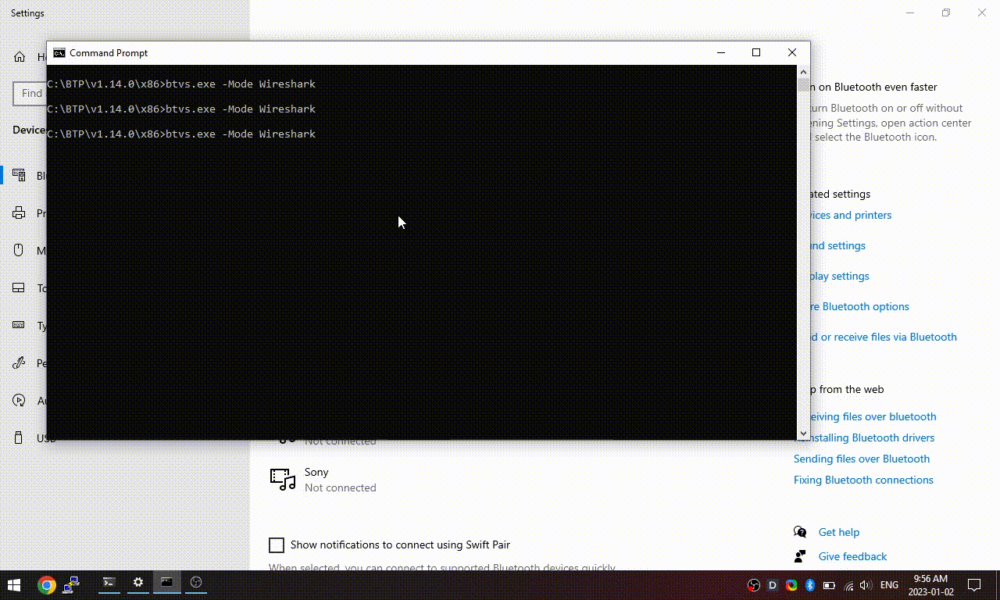

# Introduction
BlueRetro aim to support as much device as possible by trying to follow what the HID descriptor
of unknown device report. You would expect this to be quite standard but device manufacturers
are quite good at making weird descriptor. BlueRetro HID parser got tested with only a few devices.
So quite often a device won't work because it's descriptor goes around the assumption I made in the
parser code.

To help me improve support sent me a Bluetooth HCI trace done on Windows 10!

# Software to install
* Download and install latest version of Wireshark:\
  https://www.wireshark.org/#download
* Download and install latest version of Microsoft Bluetooth Test Platform:\
  https://learn.microsoft.com/en-us/windows-hardware/drivers/bluetooth/testing-btp-setup-package

# Trace examples
1. Open a windows cmd prompt and execute: C:\BTP\v1.14.0\x86\btvs.exe -Mode Wireshark
2. In the virtual sniffer window enable "Full Packet Logging"
3. Pair the device to Windows using the Bluetooth devices manager.
4. Press all the buttons on the controller one at a time taking note of the order you pressed them.
5. Stop the trace in Wireshark and save the trace.
6. Send me the .pcapng trace and your notes.

