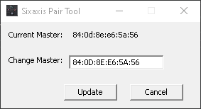

# Table of contents

* [0 - Your controller not in the list?](#0---your-controller-not-in-the-list)
* [1 - List of tested Bluetooth devices](#1---list-of-tested-bluetooth-devices)
* [2 - PS3 Pairing Guide](#2---ps3-pairing-guide)
  * [2.1 - First pairing](#21---first-pairing)
    * [2.1.1 - Windows](#211---windows)
    * [2.1.2 - OSX](#212---osx)
  * [2.2 - Reconnect](#22---reconnect)
* [3 - PS4 & PS5 Pairing Guide](#3---ps4--ps5-pairing-guide)
* [4 - Xbox Pairing Guide](#4---xbox-pairing-guide)
* [5 - Wii & WiiU Pro Pairing Guide](#5---wii--wiiu-pro-pairing-guide)
* [6 - Switch Pairing Guide](#6---switch-pairing-guide)
  * [6.1 - First pairing](#61---first-pairing)
  * [6.2 - Reconnect](#62---reconnect)
  * [6.3 - Dual Joycon Pairing Guide](#63---dual-joycon-pairing-guide)
* [7 - 8bitdo Pairing Guide](#7---8bitdo-pairing-guide)
  * [7.1 - First pairing](#71---first-pairing)
  * [7.2 - Reconnect](#72---reconnect)
  * [7.3 - D-pad as Joystick or D-pad configuration](#73---d-pad-as-joystick-or-d-pad-configuration)
* [8 - Retro-Bit Pairing Guide](#8---retro-bit-pairing-guide)
* [9 - Steam Controller Pairing Guide](#9---steam-controller-pairing-guide)
* [10 - RetroFighters Warrior Adapter Paring Guide](#10---retrofighters-warrior-adapter-paring-guide)
* [11 - RetroFighters Brawler64 Bluetooth Paring Guide](#11---retrofighters-brawler64-bluetooth-paring-guide)
  * [11.1 - First pairing](#111---first-pairing)
    * [11.1.1 - Switch Mode](#1111---switch-mode)
    * [11.1.2 - Xinput Mode](#1112---xinput-mode)
  * [11.2 - Reconnect](#112---reconnect)
* [12 - Exlene GameCube Paring Guide](#12---exlene-gamecube-paring-guide)
* [13 - Hyperkin Admiral Paring Guide](#13---hyperkin-admiral-paring-guide)

# 0 - Your controller not in the list?

I can add support for it if it's uniquely identifiable in one of it's mode of operation.\
Follow this guide to get me a Bluetooth trace of it:\
[Getting Bluetooth HCI trace with Windows 10](Bluetooth-HCI-trace-with-Win10)

# 1 - List of tested Bluetooth devices

* Controller may have multiple hardware revision, only the ones listed under **Product Number** were tested.
* Controller behavior may change between their various firmware version, only the firmware listed under **Firmware** is supported.
* Controller may have various mode of operation, only the ones listed under **Mode** is supported.
* Controller often spoof the name of another ones and may not be detectable, for those a mapping preset other than default may be required and is listed under **Mapping preset**.
* Issues reproduced by developer are listed under **Known issues**.
* Issues reported by user but not reproduced are listed under **Unconfirm issues**.

| Name | Product Number | Firmware | Mode | Mapping Src Label | Mapping preset | Pairing Guide | Known issues | Unconfirm issues |
| ---- | -------------- | -------- | ---- | ----------------- | -------------- | ------------- | ------------ | ---------------- |
| 8bitdo GBros. Adapter | 83GA | v2.26 | Xinput | GameCube | Default Gamepad | [7](#7---8bitdo-pairing-guide) |   | [#523](https://github.com/darthcloud/BlueRetro/issues/523) |
| 8bitdo M30 Bluetooth | 80HA | v1.15 | Xinput | Saturn | Default Gamepad | [7](#7---8bitdo-pairing-guide) [7.3](#73---d-pad-as-joystick-or-d-pad-configuration) |   |   |
| 8bitdo N30 Arcade Stick | NS30 | v5.10 | Xinput | Xbox One S / X\|S | Default Gamepad | [7](#7---8bitdo-pairing-guide) |   |   |
| 8bitdo N64 | RB8-N64 | v2.00 | HID Generic | N64 | Default Gamepad |   |   |   |
| 8bitdo SF30 Pro | 80DB | v2.00 | Xinput | 8bitdo SN30/SF30 | Default Gamepad | [7](#7---8bitdo-pairing-guide) |   |   |
| 8bitdo S30 Modkit |  |  | Xinput | Saturn | Default Gamepad | [7](#7---8bitdo-pairing-guide) [7.3](#73---d-pad-as-joystick-or-d-pad-configuration) |   |   |
| 8bitdo N30 Modkit |  |  | Xinput | NES | Default Gamepad | [7](#7---8bitdo-pairing-guide) [7.3](#73---d-pad-as-joystick-or-d-pad-configuration) |   |   |
| Exlene GameCube |   | 2021-11 | Xinput (but they call it IOS) | Exlene GameCube | **Exlene GameCube** | [12](#12---exlene-gamecube-paring-guide) |   |   |
| Hyperkin Admiral N64 | MO7389-AP | v1.5.010722 | Switch | N64 | Default Gamepad | [13](#13---hyperkin-admiral-paring-guide) |   |   |
| Microsoft Xbox Adaptive | 1836 | 5.15.3168.0 | Bluetooth | Xbox One S / X\|S | Default Gamepad | [4](#4---xbox-pairing-guide) |   | [#441](https://github.com/darthcloud/BlueRetro/issues/441) |
| Microsoft Xbox One S | 1708 | 5.15.3168.0 | Bluetooth | Xbox One S / X\|S | Default Gamepad | [4](#4---xbox-pairing-guide) |   | [#441](https://github.com/darthcloud/BlueRetro/issues/441) |
| Microsoft Xbox Series X\|S | 1954 | 5.15.3168.0 | Bluetooth | Xbox One S / X\|S | Default Gamepad | [4](#4---xbox-pairing-guide) |   | [#441](https://github.com/darthcloud/BlueRetro/issues/441) |
| Nintendo Switch Famicom & NES | HAC-033, 034, 035, 036 |   | Switch | Switch NES | Default Gamepad | [6](#6---switch-pro--joycon-pairing-guide) | [#146](https://github.com/darthcloud/BlueRetro/issues/146) | [#468](https://github.com/darthcloud/BlueRetro/issues/468) [#473](https://github.com/darthcloud/BlueRetro/issues/473) |
| Nintendo Switch Joycon (Dual) | HAC-015, 016 |   | Switch | Switch Joycon | **Switch Left/Right Joycon Upright** | [6.3](#63---dual-joycon-pairing-guide) | [#146](https://github.com/darthcloud/BlueRetro/issues/146) | [#468](https://github.com/darthcloud/BlueRetro/issues/468) [#473](https://github.com/darthcloud/BlueRetro/issues/473) |
| Nintendo Switch Joycon (Single) | HAC-015, 016 |   | Switch | Switch Joycon | Default Gamepad | [6](#6---switch-pro--joycon-pairing-guide) | [#146](https://github.com/darthcloud/BlueRetro/issues/146) | [#468](https://github.com/darthcloud/BlueRetro/issues/468) [#473](https://github.com/darthcloud/BlueRetro/issues/473) |
| Nintendo Switch MD & Genesis 3btns | HAC-045 |   | Switch | Switch MD / Genesis | Default Gamepad | [6](#6---switch-pro--joycon-pairing-guide) | [#146](https://github.com/darthcloud/BlueRetro/issues/146) | [#468](https://github.com/darthcloud/BlueRetro/issues/468) [#473](https://github.com/darthcloud/BlueRetro/issues/473) |
| Nintendo Switch MegaDrive 6btns | HAC-046 |   | Switch | Switch MD / Genesis | Default Gamepad | [6](#6---switch-pro--joycon-pairing-guide) | [#146](https://github.com/darthcloud/BlueRetro/issues/146) | [#468](https://github.com/darthcloud/BlueRetro/issues/468) [#473](https://github.com/darthcloud/BlueRetro/issues/473) |
| Nintendo Switch N64 | HAC-043 |   | Switch | Switch N64 | Default Gamepad | [6](#6---switch-pro--joycon-pairing-guide) | [#146](https://github.com/darthcloud/BlueRetro/issues/146) | [#468](https://github.com/darthcloud/BlueRetro/issues/468) [#473](https://github.com/darthcloud/BlueRetro/issues/473) |
| Nintendo Switch Pro | HAC-013 |   | Switch | WiiU / Switch Pro | Default Gamepad | [6](#6---switch-pro--joycon-pairing-guide) | [#146](https://github.com/darthcloud/BlueRetro/issues/146) | [#468](https://github.com/darthcloud/BlueRetro/issues/468) [#473](https://github.com/darthcloud/BlueRetro/issues/473) |
| Nintendo Switch SFC & SNES | HAC-042 |   | Switch | Switch SNES | Default Gamepad | [6](#6---switch-pro--joycon-pairing-guide) | [#146](https://github.com/darthcloud/BlueRetro/issues/146) | [#468](https://github.com/darthcloud/BlueRetro/issues/468) [#473](https://github.com/darthcloud/BlueRetro/issues/473) |
| Nintendo Wiimote | RVL-036 |   | Wii | Wiimote | Default Gamepad | [5](#5---wii--wiiu-pro-pairing-guide) |   |   |
| Nintendo Wiimote + Classic | RVL-005 |   | Wii | Wiimote + Classic | Default Gamepad | [5](#5---wii--wiiu-pro-pairing-guide) |   |   |
| Nintendo Wiimote + Classic Pro | RVL-005 (-02) |   | Wii | Wiimote + Classic Pro | Default Gamepad | [5](#5---wii--wiiu-pro-pairing-guide) |   |   |
| Nintendo Wiimote + Nunchuck | RVL-004 |   | Wii | Wiimote + Nunchuck | Default Gamepad | [5](#5---wii--wiiu-pro-pairing-guide) |   |   |
| Nintendo WiiU Pro | WUP-005 |   | Wii | WiiU / Switch Pro | Default Gamepad | [5](#5---wii--wiiu-pro-pairing-guide) | [#3](https://github.com/darthcloud/BlueRetro/issues/3) |   |
| PowerA GameCube | 1511638-01 |   | Switch | GameCube | Default Gamepad | [6](#6---switch-pro--joycon-pairing-guide) |   |   |
| Retro-Bit SEGA Saturn Bluetooth |   | v1.02 | Xinput | Saturn | Default Gamepad | [8](#8---retro-bit-pairing-guide) |   |   |
| RetroFighters Brawler64 Bluetooth |   |   | Switch | N64 | Default Gamepad | [11.1.1](#1111---switch-mode) |   |   |
| RetroFighters Brawler64 Bluetooth |   |   | Xinput | N64 | **RetroFighters Brawlers64 Xinput** | [11.1.2](#1112---xinput-mode) |   |   |
| RetroFighters Warrior Adapter |   |   | Xinput | GameCube | Default Gamepad | [10](#10---retrofighters-warrior-adapter-paring-guide) |   |   |
| Sony PS3 DualShock 3 |   |   | PS3 | PS3 | Default Gamepad | [2](#2---ps3-pairing-guide) |   |   |
| Sony PS3 Sixaxis |   |   | PS3 | PS3 | Default Gamepad | [2](#2---ps3-pairing-guide) |   |   |
| Sony PS4 DualShock 4 |   |   | PS4 | PS4 / PS5 | Default Gamepad | [3](#3---ps4--ps5-pairing-guide) |   |   |
| Sony PS5 DualSense | CFI-ZCT1W | 0307 | PS5 | PS4 / PS5 | Default Gamepad | [3](#3---ps4--ps5-pairing-guide) |   |   |
| Valve Steam Controller | 1001 | 0x5B0F21BD (2018-05-30) | Lizard (BLE) | KB & Mouse | **DC FPS for Steam ctrl lizard** | [9](#9---steam-controller-pairing-guide) |   |   |

# 2 - PS3 Pairing Guide

* Note only official PS3 controller are supported.

## 2.1 - First pairing

### 2.1.1 - Windows

1. Download and install [Sixaxis Pair Tool](https://sixaxispairtool.en.lo4d.com/windows#:~:text=The%20Sixaxis%20Pair%20Tool%20is,games%20with%20your%20PS3%20controller.)
2. Determine BlueRetro MAC address

- Open https://blueretro.io/ in a chrome web browser (desktop/android)
- Navigate to "BlueRetro System Manager"
- Click on "Connect BlueRetro"
- Pair your device

    On connection the MAC address of the device will be shown. Write it down.

    ```
    Connected to:BlueRetro_XX_XXXX
    (XX:XX:XX:XX:XX:XX)[v.x.x.x]
    ```
3. Connect your PS3 controller to PC using USB cable.
4. Launch Sixaxis pair tool and type in the address found in step #2.\

5. Click update, once done disconnect the controller from PC.
6. Boot up BlueRetro and press the PS button, the controller should connect to BlueRetro.

### 2.1.2 - OSX

1. Install Prerequisites (macOS)

- Install Homebrew https://brew.sh
- Install required libs & packages

    ```brew install wget libusb libusb-compat```

2. Compile sixpair binary

    ```
    mkdir ~/Documents/sixpair
    cd ~/Documents/sixpair
    wget -O sixpair.c https://gist.github.com/wouterds/4ab5715966812009d634e3d034abc7fc/raw
    gcc -o sixpair sixpair.c -lusb
    ```

    If everything went well you should now have a sixpair executable at `~/Documents/sixpair`.

3. Determine BlueRetro MAC address

- Open https://blueretro.io/ in a chrome web browser (desktop/android)
- Navigate to "BlueRetro System Manager"
- Click on "Connect BlueRetro"
- Pair your device

    On connection the MAC address of the device will be shown. Write it down.

    ```
    Connected to:BlueRetro_XX_XXXX
    (XX:XX:XX:XX:XX:XX)[v.x.x.x]
    ```

- Open a shell terminal and set the master PS3 address to BlueRetro MAC address

    ```
    .~/Documents/sixpair/sixpair XX:XX:XX:XX:XX:XX
    ```

## 2.2 - Reconnect

1. Simply press PS button to reconnect to BlueRetro.

# 3 - PS4 & PS5 Pairing Guide

## 3.1 - First pairing

1. Boot up BlueRetro and make sure adapter is in inquiry mode (LED pulsing)
2. Press & hold simultaneously Share & PS buttons until the LED blink white.
3. Color on controller will change once pairing is complete.

## 3.2 - Reconnect

1. Simply press PS button to reconnect to BlueRetro.

# 4 - Xbox Pairing Guide

Update firmware via the [Xbox accessories Win10 app](https://apps.microsoft.com/store/detail/xbox-accessories/9NBLGGH30XJ3).

## 4.1 - First pairing

1. Boot up BlueRetro and make sure adapter is in inquiry mode (LED pulsing)
2. Power on controller via Xbox button and then hold the black sync button until the logo blink.
3. Logo will stop blinking on controller once pairing is complete.

## 4.2 - Reconnect

1. Simply hold Xbox button for a small moment to power on controller and it will reconnect to BlueRetro.

# 5 - Wii & WiiU Pro Pairing Guide
* 1+2 pairing is not supported.

## 5.1 - First pairing

1. Boot up BlueRetro and make sure adapter is in inquiry mode (LED pulsing)
2. Press red Sync button
3. LEDs will stop blinking on controller once pairing is complete.

## 5.2 - Reconnect

1. Simply press any button on controller and it will reconnect to BlueRetro.

# 6 - Switch Pairing Guide

## 6.1 - First pairing

1. Boot up BlueRetro and make sure adapter is in inquiry mode (LED pulsing)
2. Press and hold sync button until LEDs move in a left/right pattern.
3. LEDs will stop pattern on controller once pairing is complete.

## 6.2 - Reconnect
1. Simply press any button twice on controller and it will reconnect to BlueRetro.

## 6.3 - Dual Joycon Pairing Guide

1. Go to https://blueretro.io/blueretro_presets.html and connect to your BlueRetro.
2. First select output 1 and select "Switch Left Joycon Upright" click save, wait for green text to appear.\
   
3. Then select output 2 and select "Switch Right Joycon Upright" click save, wait for green text to appear.\
   
4. Then pair the joycon with blueretro separately using the sync button hidden on the sliding side.\
   It's important to connect the left joycon first, then connect the right joycon
5. After that you can clip them on the middle support and they should function as one controller.

# 7 - 8bitdo Pairing Guide
Update firmware via the [8bitdo Upgrade tool Win10 app](https://support.8bitdo.com/firmware-updater.html).

## 7.1 - First pairing

1. Boot up BlueRetro and make sure adapter is in inquiry mode (LED pulsing)
2. Power up 8bitdo controller in Xinput mode (Start + X or set switch to X) (Only Xinput mode supported!!)
2. Press and hold sync button until LEDs flash.
3. LEDs will stop pattern on controller once pairing is complete.

## 7.2 - Reconnect
1. Simply press Start on controller and it will reconnect to BlueRetro.

## 7.3 - D-pad as Joystick or D-pad configuration
Most 8bitdo controller are configured to have the D-pad emulate a joystick by default.
In most case for BlueRetro you will want to configure it as a d-pad.

See [8bitdo support page FAQs for each controller](https://support.8bitdo.com/) for more info.

* 8bitdo S30 Modkit: Hold Up + L + R for 5 seconds
* 8bitdo N30 Modkit: Hold Up + Select for 5 seconds
* 8bitdo M30 Bluetooth: Hold Up + Select for 5 seconds

# 8 - Retro-Bit Pairing Guide

## 8.1 - First pairing

1. Boot up BlueRetro and make sure adapter is in inquiry mode (LED pulsing)
2. Power up Retro-Bit controller in Xinput mode (Home + X) (Only Xinput mode supported!!)
2. If done properly 2 LEDs will flash.
3. LEDs will stop flashing on controller once pairing is complete and rumble will trigger.

## 8.2 - Reconnect
1. Simply press Homeon controller and it will reconnect to BlueRetro.

# 9 - Steam controller Pairing Guide

## 9.1 - First pairing

1. Boot up BlueRetro and make sure adapter is in inquiry mode (LED pulsing)
2. Power on controller by holding B and then pressing the Steam button.
3. Logo will stop blinking on controller once pairing is complete.

## 9.2 - Reconnect

1. Simply press Steam button to power on controller and it will reconnect to BlueRetro.

# 10 - RetroFighters Warrior Adapter Paring Guide

## 10.1 - First pairing

1. Boot up BlueRetro and make sure adapter is in inquiry mode (LED pulsing)
2. Power on adapter by holding Home + Minus simultaneously until LED start blinking fast.
3. LED will stop blinking once pairing is complete.

## 10.2 - Reconnect

1. Simply press Home button to power on adapter and it will reconnect to BlueRetro.

# 11 - RetroFighters Brawler64 Bluetooth Paring Guide

## 11.1 - First pairing

### 11.1.1 - Switch Mode
1. Boot up BlueRetro and make sure adapter is in inquiry mode (LED pulsing)
2. Power up Brawler64 by holding sync button until LEDs move in a up/down pattern.
3. LED will stop blinking once pairing is complete.

### 11.1.2 - Xinput Mode

In this mode the controller will mock an Xbox controller and can't be uniquely identified.
As such you need to load the **RetroFighters Brawlers64 Xinput** preset.

1. Boot up BlueRetro and make sure adapter is in inquiry mode (LED pulsing)
2. Power up Brawler64 by holding both B & sync buttons until LEDs 1 & 4 start blinking.
3. LED will stop blinking once pairing is complete and LEDs 1 & 4 will be on to indicate Xinput mode.

## 11.2 - Reconnect

1. Simply press any button a few time to power it on and it will reconnect to BlueRetro.

# 12 - Exlene GameCube Paring Guide

The controller will mock an Xbox controller and can't be uniquely identified.
As such you need to load the **Exlene GameCube** preset.

## 12.1 - First pairing

1. Boot up BlueRetro and make sure adapter is in inquiry mode (LED pulsing)
2. Power up the Exlene controller by holding Y + Home simultaneously until LED start blinking fast.
3. LED will stop blinking once pairing is complete.

## 12.2 - Reconnect

1. Simply press Home button to power on Exlene controller and it will reconnect to BlueRetro.

# 13 - Hyperkin Admiral Paring Guide

## 13.1 - First pairing

1. Boot up BlueRetro and make sure adapter is in inquiry mode (LED pulsing)
2. Power up the Exlene controller by holding Y + Home simultaneously until LED start blinking fast.
3. LED will stop blinking once pairing is complete.

## 13.2 - Reconnect

1. It's important to press the A button to power on the Admiral controller as it's select the default internal mapping of the controller.\
   It will reconnect to BlueRetro after doing so.
