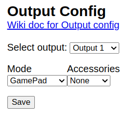
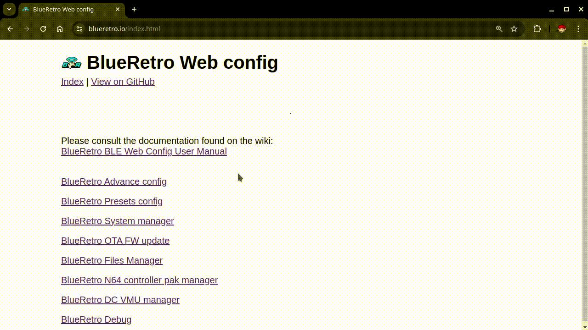
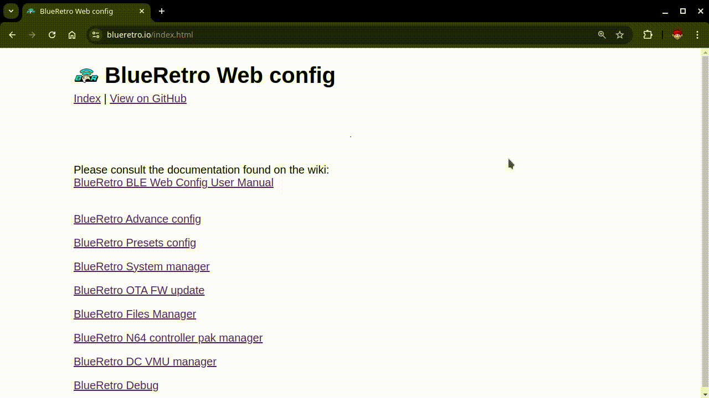
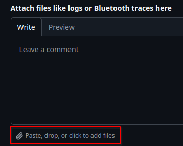

# BlueRetro Debug Trace

## Introduction
BlueRetro aims to support as many devices as possible by trying to follow the HID descriptor reported by unknown devices. You might expect this to be quite standard, but device manufacturers are surprisingly good at creating unusual descriptors. The BlueRetro HID parser has been tested with only a few devices, so quite often, a device won't work because its descriptor deviates from the assumptions made in the parser code.

To help improve support, please send me a BlueRetro debug trace generated directly from your BlueRetro adapter.

The **debug mode** reuses the RAM normally reserved for the virtual memory card feature of BlueRetro. As such, the virtual memory card cannot be used while in **debug mode**. However, your virtual memory card content will not be overwritten, as it is stored on the adapter's flash memory. As an extra precaution, you may want to back up its content using either the Dreamcast or Nintendo 64 memory card manager pages.

## Step 1 - Enable debug mode
Only Chromium-based browser are supported (ex: Google Chrome).\
BlueRetro version v25.01 and up only.

* Visit [blueretro.io](https://blueretro.io/) and click `BlueRetro Advance config`.
* Click the `Connect BlueRetro` button to open a Bluetooth device pairing menu.
* Select your BlueRetro adapter from the device list and click `Pair` to access the configuration menu.
* If you have used the virtual memory card feature, make sure to disable it by setting `Accessories` to **None** and clicking `Save` under the `Output config` section.\

* In the Global config section, change `Memory Card Bank` to **Debug mode** and click `Save`.
* Power cycle the adapter, and **debug mode** will be enabled.

**Note**: If the Bluetooth device pairing menu does not open and you are using a Chromium-based browser, open a new browser tab and enter chrome://flags, search for "Web Bluetooth API", and set the option to Enabled.

## Step 2 - Reproduce issue

* Connect your Bluetooth device to BlueRetro.\
  *(Consult your Bluetooth device's instruction manual to learn how to pair it.)*
* For issue reporting:\
  Perform any actions needed to reproduce your issue.
* For adding support for a new Bluetooth device:\
  Press all the buttons on the controller one at a time, taking note of the order in which you pressed them.
* Turn off your Bluetooth device.\
  *(Consult your Bluetooth device's instruction manual to learn how to turn it off.)*

**Note**: The RAM space for saving traces is very limited. If you fail to reproduce your issue on the first try, make sure to power cycle the adapter before trying again.\
**Note**: If your Bluetooth device has multiple connection modes, take a separate debug trace for each mode.

## Step 3 - Download debug trace

* Visit [blueretro.io](https://blueretro.io/) and click `BlueRetro Debug`.
* Click the `Connect BlueRetro` button to open a Bluetooth device pairing menu.
* Select your BlueRetro adapter from the device list and click `Pair` to access the debug menu.
* Click the `Download debug trace` button to start downloading the debug trace.
* The browser will automatically download a file named `br_debug_trace.bin` once the progress bar reaches 100%.

## Step 4 - Zip & Upload debug trace

* Zip the `br_debug_trace.bin` file by right clicking on it and selecting:
  * Windows 10: Send to -> Compressed (zipped) folder.
  * Windows 11: Compress to ZIP file.
  * macOS: Compress "br_debug_trace.bin".
  * KDE Plasma: Compress -> Here as "br_debug_trace.bin.zip".
* Upload the zip file to a new or existing [Github issue](https://github.com/darthcloud/BlueRetro/issues).\

## Step 5 - Disable debug mode

* Visit [blueretro.io](https://blueretro.io/) and click `BlueRetro Advance config`.
* Click the `Connect BlueRetro` button to open a Bluetooth device pairing menu.
* Select your BlueRetro adapter from the device list and click `Pair` to access the configuration menu.
* If you have used the virtual memory card feature, make sure to reenable it by setting `Accessories` brack from **None** to previous setting.\

* In the Global config section, change `Memory Card Bank` to previously used bank and click `Save`.
* Power cycle the adapter, and **debug mode** will be disabled.
