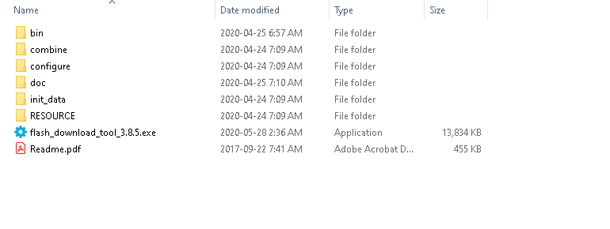
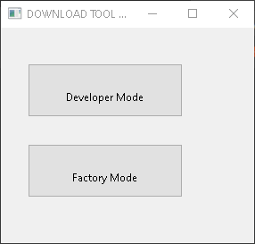
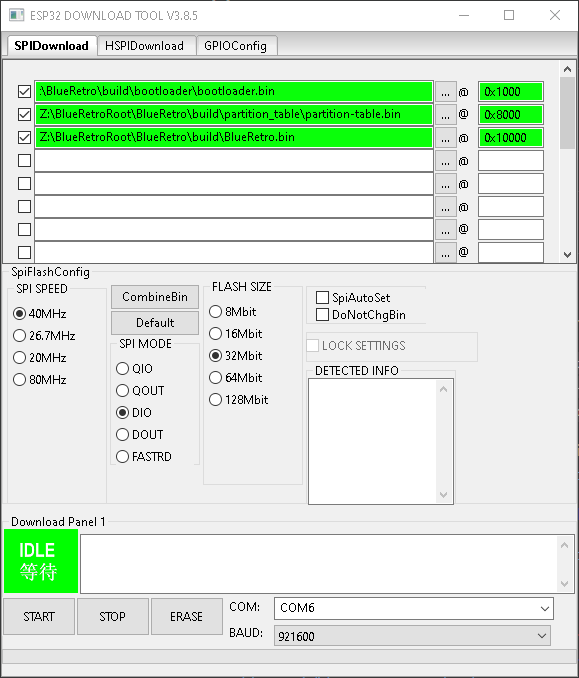
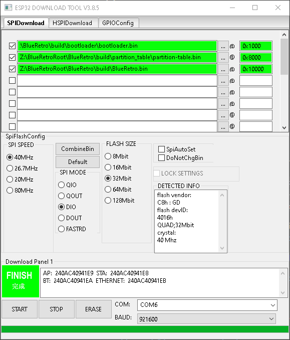

# Flashing firmware Windows 10
1. Download the [Flash Download Tools](https://www.espressif.com/en/support/download/other-tools) and unzip.
2. Execute flash_download_tool_3.8.5.exe

3. Select Developer Mode

4. Select ESP32 DownloadTool

5. Select and check the 3 binary file in the first 3 field and match the option as in screenshot.

6. Select proper COM port for your machine.
7. Press START
8. Wait for status to change to FINISH.
