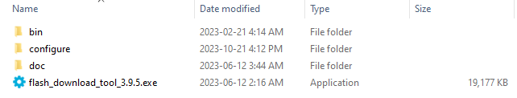
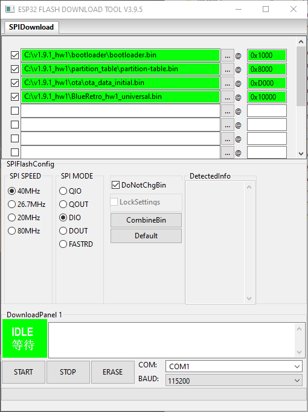

If the COM port of the ESP32 doesn't show up, refer to this guide from espressif (try installing the drivers they suggest).
https://docs.espressif.com/projects/esp-idf/en/latest/esp32/get-started/establish-serial-connection.html

1. Download the [Flash Download Tools](https://www.espressif.com/en/support/download/other-tools) and unzip.
2. Execute flash_download_tool_x.y.z.exe\
   
3. Select develop Mode\
   Select ESP32 DownloadTool\
   
4. Select and check the first 3 binary files in the first 3 fields and match the option as in the screenshot.\
   For the 4th field, check it too and use the firmware that match your adapter type.\
   In order each bin offset value are: 0x1000, 0x8000, 0xD000 & 0x10000.\
   
5. Select proper COM port for your machine.
6. Press START
7. Wait for status to change to FINISH.
