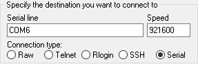
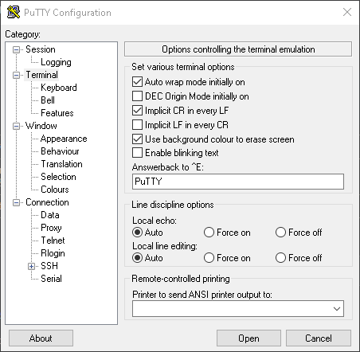
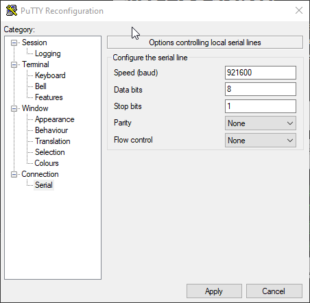

# **When using DevKitC USB port for serial debug DO NOT CONNECT the 3.3v or 5V pin coming from game system. Power will be provided from USB**

## Getting BlueRetro debug logs via Serial port Windows 10
1. Download & install [PuTTY](https://www.chiark.greenend.org.uk/~sgtatham/putty/latest.html) or use your favorite terminal emulator.
2. Select serial and set right COM port and set speed to 921600\

3. In "Terminal" check "Implicit CR in every LF"\

4. (Optional) If reboot on serial connection is undesirable, disable flow control under serial menu.\

5. Back in session you may save those setting for later.
6. Click "Open"
7. Reproduce issue and copy the whole log to a .txt file.
8. Open issue in GitHub and attach file with step for reproduction.