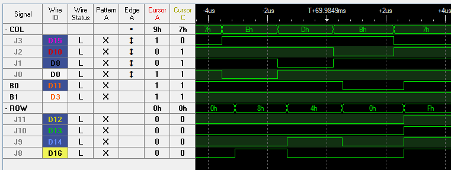
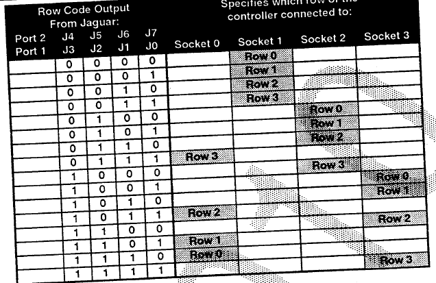
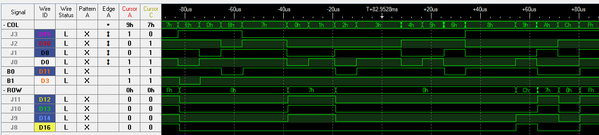
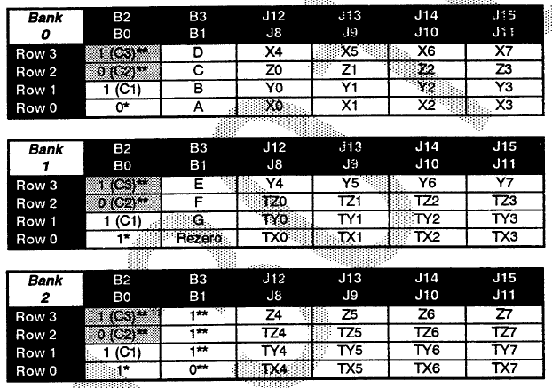
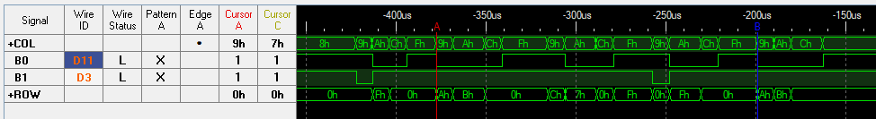

The Jaguar interface work as either a buttons matrix (Std pad) or as multiplexed buttons/data (TeamTap and advanced controller). The way the various controllers and accessories work is very well explained in the [Jaguar Console Hardware Release Notes](04_Technical_Reference.pdf).

# Standard controller
J0-J3 for player 1 and J7-J4 for player 2 (the column inputs) are used to select a row to output from the controller. Those are active low and only one column should be active at a time. Otherwise the output from the controller will be invalid.

\
_Columns are typically set in the order 0xE, 0xD, 0xB & 0x7_

The C2 & C3 identification bits (Row2 & Row3 B0 bits) will be both set for standard controller. (Same for no controller connected.)

# TeamTap
The TeamTap use all possible value combination of the 4 COL inputs to address the 3 additional controllers. The first slot is addressed using the same value 0xE, 0xD, 0xB & 0x7 as a regular controller to be transparent to software not supporting the TeamTap.

The TeamTap can be detected by reading bit C1 from last slot. Due to the way the standard controller is wired, pressing Pause at the detection time will make software falsely detect the TeamTap.

# 6D controller
Atari defined specification for various controllers that ultimately never got released. One of the most interesting is the 6D controller that was supposed to be a 6-axis flight stick. BlueRetro implement this protocol but repurpose the 6 axes for the modern dual stick, dual trigger setup. Extra data is output by using a bank scheme. Each time all four rows are read the data automatically switch to the next bank. The first bank can be detected via bit B0 or Row0 being low.

