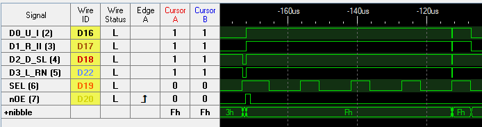
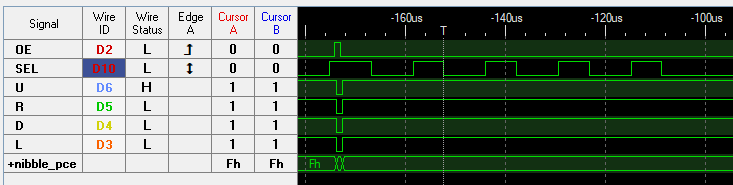
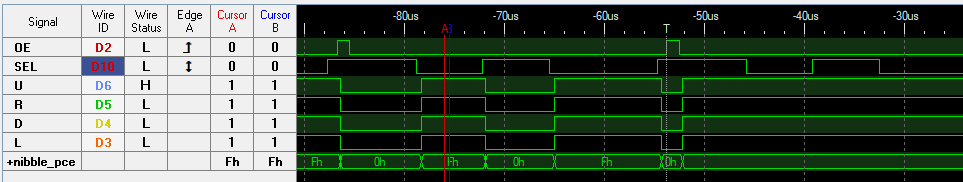
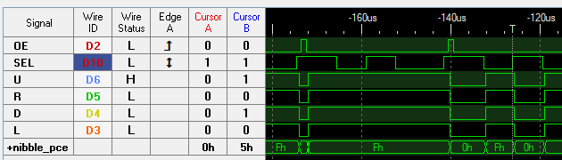
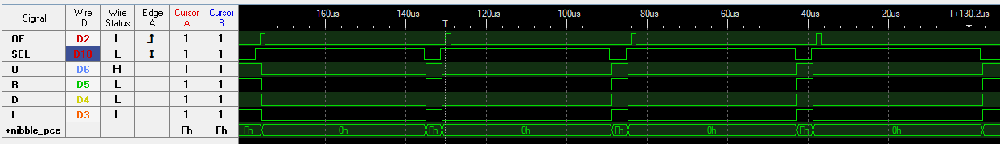

The PCE interface is similar to how the Genesis work but a little bit simpler as it didn't need to be backward compatible with anything else.
Eight inputs are multiplexed on four data lines (URDL) with a select line (SEL). An output enable line (/OE) disable the peripheral output and is used
as a latch or toggle to control special peripherals like the multitap or the 6 buttons controller. 

# Multitap
After each SEL High/Low cycle, the multitap will output data from a different controller port.
The /OE line is used to reset back to output the first port.

_Bomberman '94 with 5 regular controller_

Even if no multitap are connected to the system, most software will poll the controller 5 time in a row.
All five cycle will be data from the first controller in that case.

# Standard controller
When SEL is high D-pad directions are output and when SEL is low buttons I, II, Select and Run are output.
A 3 buttons controller simply add an extra button that can be set to be either Run or Select button.

_No multitap present but controller still polled 5 times by Duo BIOS_

# 6 buttons controller
Four extra buttons (III, IV, V & VI) are added by adding an additional bank that is toggled via the /OE line.
So each time the /OE line is toggled the available output switch between the regular bank and the extra one. The eight inputs are still multiplexed as usual via the SEL line.
The controller can be identified by the D-pad directions being all low in the extra bank while SEL is high.

_Final Fight poll twice in a row (see /OE line), in this case only one controller present so the two SEL cycles are identical_

_Final Fight with multitap and two 6 btns controllers, notice the extra bank data can be in either the first or second poll. Depend on timing the 6 btns switch was enabled._

# Mouse
The mouse always output the standard buttons on low SEL. II is left button and I right.
Axes data is output on SEL high. /OE line is used to latch the next axes data.
X axis MSB nibble is output first, then X axis LSB nibble, then Y axis MSB nibble and finally Y axis LSB nibble.
Axes data is signed two's complement. Unlike every other mouse I saw the left direction is positive!! Up direction is negative.

_Mouse idle_

